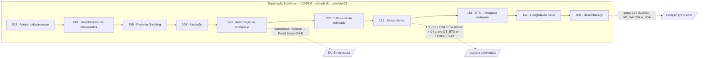

# How we get from 10,000 lines of extraction to a flowchart a human can read

**Written 2026-07-20 by RL**, in answer to a fair challenge: the waves produced a great deal of
technical material, and it is not self-evident how that becomes a swimlane diagram an operations
manager recognises. This document states the derivation path, what is already in hand, and what is
genuinely missing.

---

## 1. What a readable process map actually requires

Five ingredients. They are not equally available to us.

| # | Ingredient | Source | Status |
| --- | --- | --- | --- |
| 1 | **The frame** — which distinct processes exist, by unit / vertical / type | `NR_PROCESSO` encoding + `TSERVICO` schema | ✅ **In hand** |
| 2 | **The steps** — what activities make up each process | `TEVENTO` rows | ⚠️ **Partial** — codes yes, names mostly no |
| 3 | **The order** — the sequence and the SLA between steps | `TSERVICO_EVENTO.NR_ORDEM`, `PZ_DO_EV_BASICO` | ❌ **MISSING — this is the blocker** |
| 4 | **The lanes** — who performs each step | `TEVENTO.CD_RESPONSAVEL` → `TCARGO` names | ❌ **Missing** |
| 5 | **The overlays** — what is automated, where the exceptions are | W3 module map + W2 literal inventory | ✅ **In hand** |

**A flowchart is ingredients 2 + 3. A swimlane is 2 + 3 + 4.** We have the frame and the overlays —
the context around the diagram — and we are missing the diagram's spine.

---

## 2. What we can build today

### 2.1 The frame — derived, not asked for

The process number is a structured key: `UU PP TT-NNNNNN-YY`.

Measured across 800 sampled process numbers:

- **`UU`** unidade de negócio — `01` (758), `07` (23), `02` (19)
- **`PP`** produto — `02` (412), `01` (280), `06` (108)
- **`TT`** process type — `EM` (240), `IM` (180), `FE` (100), `ER` (87), `EA` (57), `IA` (50), …

The `TT` codes split cleanly along the import/export boundary: `TPROCESSO_EXP` contains **only**
`E*` codes (`EM`/`ER`/`EA`/`EG`) plus `JA`, while `TPROCESSO` holds the rest. Read as
**E = Exportação, I = Importação**, second letter = modal (**M**arítimo, **R**odoviário, **A**éreo).

This is corroborated independently: `TR_FOLLOWUP` itself branches on
`SUBSTRING(@NR_PROCESSO, 3, 4) IN ('01IE','01DD')`, and `TR_FLP_PROCESSO_CNTR` on
`SUBSTRING(@NRPROCESSO, 3, 2) <> '02'`. The system reads its own process numbers positionally, so
the convention is load-bearing, not cosmetic.

**So the top of the MECE tree is derivable now, from data we already hold.**

### 2.2 A partial event dictionary — recovered from code, not from the client

We do not have `TEVENTO`'s rows, so we cannot name events directly. But **views alias event dates
with meaningful column names**, which leaks the vocabulary:

| Code | Recovered name | Reading |
| --- | --- | --- |
| `003` | `CD_EV_ABRE_PROC` | Abertura do processo |
| `001` | `DT_DOCS` | Recebimento de documentos |
| `354` | `DT_NECESSIDADE` | Data de necessidade |
| `355` | `DT_RESERVA` | Reserva (booking) |
| `300` | `DT_ALOCACAO` | Alocação |
| `263` | `DT_AUT_EMBARQUE` | Autorização de embarque |
| `359` | `DT_ETD` | ETD — saída estimada |
| `154` | `DT_VOO` | Voo (aéreo) |
| `161` | `DT_ETA` | ETA — chegada estimada |
| `162` | `DT_CH_NAVIO` | Chegada do navio |
| `351` | `DT_DEF_LI` | Deferimento da LI |
| `100` | `DT_VENC_LI` | Vencimento da LI |
| `255` | `DT_SOLIC_NUM` | Solicitação de numerário |
| `333` / `668` | `PREV_CHEGADA` / `_ATZ` | Previsão de chegada |

Plus four established by the earlier audit: `003` abertura, `088` desembaraço, `132` saída,
`162` chegada.

**Coverage: roughly 30–40 of the 147 event codes hardcoded in T-SQL.** Enough to draw a *credible
illustrative* diagram. Not enough to draw the *real* one — and the difference matters, because a
diagram that looks authoritative while being one-quarter guessed is worse than no diagram.

### 2.3 The overlays — already complete

- **Automation**: from the module map. E.g. `robodue` performs the DU-E steps via Portal Único and
  writes `TFOLLOWUP` directly; the three `parametrizacao*` modules drive the Siscomex web UI.
- **Exceptions**: from the literal inventory — 147 event codes, 34 client groups, 19 clients
  hardcoded in SQL.
- **Handoffs**: counterparties identified per module (government, client, carrier, despachante
  union, órgãos anuentes).

---

## 3. The blocker, stated exactly

**Sequence cannot be derived from anything we hold.**

Two routes were tested and both are closed:

1. **From parametrization** — `TSERVICO_EVENTO.NR_ORDEM` gives the canonical order of steps per
   service, with each step's SLA relative to a base event. We have the *schema* of this table and
   **none of its rows**. This is item H of A2.
2. **From observed history** — in principle, ordering events by `DT_REALIZACAO` within a process
   would recover the real sequence empirically. **Tested: it does not work.** The
   `TFOLLOWUP` sample contains 200 rows spanning 200 *distinct* processes — one event each. It is a
   random sample across processes, not a per-process history. There is no sequence in it to recover.

> **This changes item H's status.** It was framed as "best value per effort". It is in fact
> **strictly necessary**: without `TSERVICO_EVENTO`, there is no flowchart — only a list of steps in
> arbitrary order. The same request also carries `TEVENTO` (step names, and `CD_RESPONSAVEL` for the
> swimlanes) and `TCARGO` (role names). **One export unlocks ingredients 2, 3 and 4 simultaneously.**

A second, smaller ask now also has a clear purpose: **a full follow-up history for ~20 real
processes** (all `TFOLLOWUP` rows for 20 given `NR_PROCESSO` values, spread across import/export and
modal). That lets us verify the parametrized order against what actually happened — the E1-vs-E2
check — and it is what turns the map from "how it is configured" into "how it is run".

---

## 4. What the output will look like

Illustrative only — the shape is right, the content is the ~30 events we can name. Every node would
carry an evidence tag in the real artifact.

The swimlane version is the same graph with `CD_RESPONSAVEL` resolved into lanes — which is exactly
the column we do not yet have values for.

**Note what the overlays already do for us.** The dotted edges are not decoration: they are the
automation boundary and the exception layer, and they come entirely from work already completed.
When the sequence arrives, it drops into a frame that is already populated.

---

## 5. Sequencing

| Step | Depends on | Status |
| --- | --- | --- |
| Build the frame (unit × produto × tipo tree) | nothing | **can start now** |
| Build the automation + exception overlays | waves 1–3 | **can start now** |
| Draft per-process templates with the ~30 named events | above | **can start now**, clearly marked provisional |
| **Order the steps · name the rest · assign lanes** | **item H** | **blocked** |
| Validate configured order against real history | 20-process follow-up dump | blocked |
| Client correction pass | draft + Wagner/Andrea | after the above |

The honest summary: **we can build everything around the diagram, but not the diagram itself.**
That is an argument for sending item H today, not an argument that the waves were wasted — the waves
are what make the eventual diagram *interpretable* rather than a bare sequence of codes.
