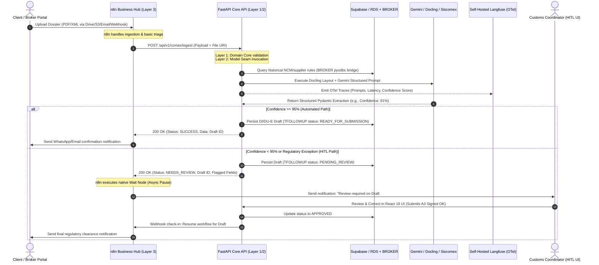

# Comprehensive Architectural Lessons Learned & Framework Analysis for MyINDAIA

**Date:** 2026-07-20  
**Context:** MyINDAIA Greenfield Modernization Strategy (`FastAPI`, `React 19`, `Supabase`/`RDS`, `n8n`, `LangGraph`)  
**Source Baseline:** Exhaustive extraction and cross-mapping of `ai-agent-frameworks-and-n8n-lessons-learned.md` and `framework-orchestration-analysis-2026-07-04.md` from the *Credit Card Expenses Analyzer* repository.  
**Purpose:** Provide the foundational architectural principles, framework evaluations, and production runbook guardrails to resolve the Tier-1 decisions during the MyINDAIA Discovery Phase.

---

## Executive Summary & Core Principles

1. **Orchestration is Rarely the Moat (The Moat vs. Commodity Rule):**  
   In structured document processing (whether financial credit card statements or customs brokerage packages like DI, DU-E, BL, and Commercial Invoices), the workflow execution graph is typically bounded and trivial (sequential steps + bounded retry loops + simple conditional routes). **Do not confuse orchestration scaffolding with domain engineering.** The real value, risk, and complexity live in multimodal prompt engineering, spatial document pre-processing (`Docling`/`OpenDataLoader`), deterministic reconciliation math, and automated CI evaluation harnesses.
2. **The 3-Layer Lock-In-Free Architecture:**  
   Confining AI capabilities and external orchestrators to thin seams while keeping the **Domain Core (`Layer 1`) 100% pure, framework-free Python** prevents vendor lock-in and guarantees testability, maintainability, and CI regression enforcement without live external endpoints.
3. **"Wrap, Don't Rebuild" (n8n as the Outer Integration Hub):**  
   n8n excels as the connective tissue (event ingestion, routing triage, asynchronous Human-in-the-Loop review pauses, and multi-channel notifications) over stateless HTTP services (`POST /api/v1/...`). However, it becomes a severe technical debt liability if core business rules, prompt templates, or data parsing are pushed into canvas `Code Nodes`.
4. **n8n Tier Reality (`Business` vs. `Community` vs. `Enterprise`):**  
   While the free `Community` edition lacks Git versioning, staging environments, and RBAC, adopting an **n8n Business plan** (€667/mo or self-hosted equivalent) provides **Git integration, dev/prod environment isolation, workflow diffs, and fine-grained RBAC**. However, even on the Business plan, keeping business logic inside the Git repository (rather than inside n8n `Code Nodes`) remains best practice due to developer UX (IDE linting, step-through debugging, and `pytest` ground-truth evals).
5. **Decoupled Observability (`Langfuse` via OpenTelemetry):**  
   Observability is decoupled from framework selection because modern tools speak OpenTelemetry (OTel). For high-risk, sensitive data subject to LGPD (like credit cards or corporate customs data from `BASF`, `Nestlé`, `Pirelli`), **Langfuse** (open-source MIT core, first-class self-hosting) is the superior default over SaaS-leaning control planes (like `LangSmith` or `Agno Studio`).

---

## 1. Where the Real Value & System Complexity Live

Both financial statement processing and COMEX customs brokerage share an identical risk/value profile. We must allocate engineering bandwidth according to the exact complexity matrix extracted from the reference implementations:

```
┌────────────────────────────────────────────────────────────────────────┐
│  HIGH VALUE / HIGH RISK (Moat — belongs in pure-Python repo + CI)     │
│  • Multimodal Vision Extraction Prompts & Batching                     │
│  • Deterministic Reconciliation Math (e.g., DU-E / BL weight checks)   │
│  • Spatial PDF Pre-Processing (XY-Cut layouts / Docling tables)        │
│  • Automated Ground-Truth Evaluation Harnesses (pytest CI gates)       │
├────────────────────────────────────────────────────────────────────────┤
│  COMMODITY / TRIVIAL (Can use thin functions or outer tools like n8n)  │
│  • Sequential Step Execution                                           │
│  • Bounded Retry Loops (e.g., retry OCR extraction up to 3 times)      │
│  • Static Routing / Branching (e.g., route by customs regime or bank)  │
└────────────────────────────────────────────────────────────────────────┘
```

### Key Engineering Rules for MyINDAIA:
* **Don't Confuse Scaffolding with Engineering:** Building a robust `DU-E` or `DUIMP` parsing engine requires solving edge cases in OCR table fragmentation, token-limit truncation, schema validation (`Pydantic`), and numerical reconciliation (`net_weight + tare_weight == gross_weight`). None of these are solved by graph engines like `n8n` or `LangGraph`.
* **Evaluation is Your Safety Net:** Maintaining a CI-authoritative ground-truth test suite (`pytest`) measuring Recall, Precision, and numerical drift across ~50 historical client documents (`BASF`, `Nestlé`, `Pirelli`) is mandatory before upgrading prompt templates or switching LLM providers (e.g., from `Gemini 1.5 Pro` to `Gemini 2.5 Pro`).

---

## 2. AI Agent Frameworks vs. Pure Python: Deep-Dive Analysis

### The Control-Plane Lock-In Trap (`Agno` vs. `LangGraph`)
When using full-stack frameworks like `Agno` (`Workflow`, `Step`, `Loop`, `Router`, `AgentOS Studio`) or heavy `LangGraph` state machines, the deepest coupling is **not** the LLM call—it is the framework's control flow and state management primitives. Simple procedural constructs (like a `while` loop retrying extraction until totals reconcile, or an `if/else` checking a Siscomex LPCO cache) become framework-specific types that are difficult to refactor or unit-test independently.

### When Framework Orchestration Actually Earns Its Weight
A heavy agent framework is justified **only** when your system requires one of the following six distinct capabilities:

| Capability | Meaning | Applicable to MyINDAIA COMEX Agents? |
| :--- | :--- | :--- |
| **1. Unbounded / Dynamic Control Flow** | The LLM dynamically decides the graph execution path at runtime; step count unknown upfront. | **No.** Almost all 10 proposed COMEX agents (`Ingestão`, `NCM`, `Compliance`, `Booking`) follow deterministic, known sequences. |
| **2. Durable Execution & Checkpointing** | Tasks span hours/days and must survive process restarts and resume mid-graph from persisted state. | **Yes, specifically at the Human-in-the-Loop (`HITL`) verification gate** (e.g., pausing while a customs coordinator reviews a flagged DI/DU-E draft). |
| **3. Async Human-in-the-Loop (`HITL`)** | Process suspends, waits for human approval via UI/form, and resumes execution upon webhook check-in. | **Yes.** Essential for regulatory sign-offs (`A3 Digital Certificates` and low-confidence OCR flags). |
| **4. Dynamic Multi-Agent Coordination** | Complex supervisor/worker parallel fan-out and state gathering across shared memory spaces. | **Rarely.** Most interactions can be modeled as sequential service calls rather than shared-memory agent swarms. |
| **5. Conversational Memory** | Multi-turn chat threads that persist and get retrieved over long histories. | **Only** for potential future natural language assistant features (`Agent 08: Comunicação` chatbot). |
| **6. Live UI Streaming** | Token-by-token streaming, tool-call cards, and progress updates to a frontend. | **Yes**, for interactive chat surfaces or real-time extraction progress bars in `React 19`. |

### Framework Verdicts & Pareto Optimization
* **Pareto Rule (Collapse Framework Scaffolding):** In the reference analyzer repository, collapsing `Agno` loops (`Loop("extract_with_retry")`) and routers (`Router(categorize_router)`) into plain Python (`while` and `if/else`) reduced code footprint and eliminated framework lock-in.
* **MyINDAIA Greenfield Strategy:** Keep the core execution sequence inside pure Python (`FastAPI`). Reserve **LangGraph** (thin, checkpointed state graph) **exclusively** where genuine durable execution across days or parallel multi-agent swarming is required. For simple asynchronous pauses, **n8n's native `Wait / Form` nodes** can completely absorb the durability requirement without needing `LangGraph` at all.

---

## 3. The 3-Layer Lock-In-Free Architecture for MyINDAIA

To isolate AI model churn from customs brokerage business logic, MyINDAIA must enforce a strict three-layer architecture:

```
┌────────────────────────────────────────────────────────────────────────┐
│ Layer 1: DOMAIN CORE (Pure Python — Framework-Free)                    │
│ • Pydantic schemas for BL, Commercial Invoice, Packing List, DU-E, DI  │
│ • Spatial table salvage & Docling pre-processing rules                 │
│ • Deterministic customs reconciliation (weights, CIF/FOB calculations) │
│ • pyodbc / Delphi BROKER read-only historical bridge queries           │
│ • ZERO AI framework imports (no LangGraph, no n8n, no Agno, no SDKs)   │
├────────────────────────────────────────────────────────────────────────┤
│ Layer 2: MODEL SEAM (Thin & Swappable)                                 │
│ • call_model(prompt, images, schema) -> Validated Pydantic Object      │
│ • Wraps Gemini SDK / OpenRouter with structured output validation      │
│ • Automatic backoff retries and OpenTelemetry span generation          │
├────────────────────────────────────────────────────────────────────────┤
│ Layer 3: ORCHESTRATION (n8n Integration Hub / FastAPI HTTP Routes)    │
│ • Stateless trigger reception (S3/Drive folder watch, INTTRA Webhook)  │
│ • Procedural pipeline execution: parse -> verify -> check_ncm -> store │
│ • Asynchronous HITL pauses via n8n Wait nodes or checkpointer status   │
└────────────────────────────────────────────────────────────────────────┘
```

### Anti-Lock-In Tactics:
1. **Orchestration nodes (`Layer 3`) hold zero business logic.** They are thin wrappers that invoke `Layer 1` / `Layer 2` functions over HTTP (`POST /api/v1/comex/parse-invoice`).
2. **State is your own `Pydantic` schema**, not framework-native objects.
3. **Persist canonical state to `PostgreSQL` (`TFOLLOWUP` / `TDETALHE_MERCADORIA`) directly.** Framework checkpoints (whether in `n8n` or `LangGraph`) are transient operational state, not the source of truth.

---

## 4. n8n for AI Workflows: Enterprise vs. Business Tier & Governance

### The "Wrap, Don't Rebuild" Rule
Keep `n8n` thin. Use `n8n` as the outer integration hub connecting external COMEX protocols (`INTTRA`, `Mercante`, `Siscomex` scrapers, email parsing) to your stateless `FastAPI` endpoints. **Never put core prompt templates, JSON repair loops, or customs compliance calculations into n8n `Code Nodes`.**

### n8n Tier Breakdown (`Business` Plan Alignment)
The project alignment indicates that MyINDAIA will likely adopt the **n8n Business Plan** (€667/mo or self-hosted business license). Here is exactly what that tier unlocks compared to the free `Community` edition and what gaps remain:

| Feature | Community (Self-Hosted Free) | Business Plan (Target Alignment) | Enterprise Plan (Custom SaaS/Self-Host) | Impact on MyINDAIA Strategy |
| :--- | :--- | :--- | :--- | :--- |
| **Self-Hosting / Data Locality** | ✅ Free | ✅ Option available | ✅ Option available | **Mandatory.** Keeps Pirelli/BASF/Nestlé data inside AWS `sa-east-1` VPC. |
| **Git Version Control** | ❌ No | ✅ **Yes** | ✅ Yes | Enforces "Git as Single Source of Truth" for visual workflows. |
| **Environments (`Dev / Prod`)** | ❌ No | ✅ **Yes** | ✅ Yes | Allows safe testing of B2B plumbing before pushing to live customs flows. |
| **Workflow Diffs** | ❌ No | ✅ **Yes** | ✅ Yes | Enables code-review side-by-side diffs of canvas modifications. |
| **RBAC / Custom Project Roles** | ❌ No | ✅ **Yes** | ✅ Yes | Isolates operational teams; prevents unauthorized workflow edits. |
| **Queue Mode / Worker Scaling** | ⚠️ Basic Redis mode | ✅ **Multi-main + Workers** | ✅ High throughput | Guarantees horizontal scale (>200 exec/s) during high-volume shipment peaks. |
| **Log Streaming (SIEM / OTel)** | ❌ No | ❌ No | ✅ **Enterprise Only** | **Why Layer 2 matters:** Since n8n won't stream traces to OTel on Business, `FastAPI` must emit `Langfuse` traces directly. |
| **External Secret Manager** | ❌ No | ❌ No (Built-in enc only) | ✅ Vault / AWS / Azure | Built-in database encryption at rest is sufficient for Phase 1. |

### Strategic Takeaway from the Tier Analysis:
Adopting the **n8n Business Plan** directly eliminates the biggest governance critiques of visual orchestration: workflows can now be **version-controlled via Git, diffed in PRs, tested in a Dev environment, and governed by fine-grained RBAC**. 
*However*, **this reinforces—rather than replaces—the need for the 3-Layer architecture.** Why? Because `Git` versioning on n8n versions the *JSON graph schema*, not the complex Python logic inside `Code Nodes`. Furthermore, n8n `Business` lacks external OTel log streaming. By keeping all domain algorithms and AI calls inside `FastAPI` (`Layer 1/2`), you get full `pytest` CI evaluation coverage and direct `Langfuse` OTel trace generation, while leveraging n8n's Business tier where it truly excels: version-controlled B2B plumbing, webhook ingestion, and multi-channel routing.

---

## 5. Observability: Why Langfuse Wins (`LangSmith` vs. `Langfuse`)

Because both `Agno` and `LangChain/LangGraph` natively export OpenTelemetry (OTel), the choice of observability backend is **decoupled from framework selection**.

| Criteria | LangSmith | Langfuse (Recommended Default) |
| :--- | :--- | :--- |
| **License & Source** | Proprietary SaaS | **Open-source (MIT core)** |
| **Self-Hosting Capability** | Enterprise-tier paid add-on | **Free, first-class Docker/Kubernetes deployment** |
| **Data Residency (LGPD)** | Data leaves VPC unless high-end enterprise contract | **100% inside your AWS VPC (`sa-east-1`) alongside Postgres** |
| **Tracing Architecture** | Native LangChain callback hook + OTel | Native OTel ingestion (traces `FastAPI`, `LangGraph`, and raw SDKs equally well) |
| **Cost & Lock-In** | High SaaS consumption costs; vendor-locked UX | Zero licensing cost for self-host; fully vendor-neutral |

### Recommendation for MyINDAIA:
**Deploy Self-Hosted Langfuse via Docker on AWS (`sa-east-1`).** Customs documents contain sensitive financial figures, tax IDs (`CNPJ`), pricing contracts (`MQC`), and proprietary client supply chain routes (`BASF`, `Pirelli`). Routing LLM traces to an external SaaS control plane introduces major legal and compliance friction. Self-hosted Langfuse captures full prompt histories, token costs, latencies, and evaluations completely within the corporate perimeter.

---

## 6. The "Non-Technical Maintainer" Boundary & Discovery Assessment

One of the most critical structural questions to assess and resolve during the project is: **How much control should non-technical personnel (`Operations`, `Tech Ops`, `Commercial`) have over system behavior vs. plumbing, and where should that interface live?**

### The Trade-Off Matrix: `React 19 Admin UI` vs. `n8n Canvas`

| Adjustment Type | Nature of Change | Option A: Expose via n8n Canvas (`Business Tier`) | Option B: Data-Driven UI (`React 19` + `PostgreSQL`) | Discovery Assessment Strategy & Recommendation |
| :--- | :--- | :--- | :--- | :--- |
| **Plumbing & Notifications** (e.g., routing alerts to new WhatsApp/Email channels, adding carrier webhook endpoints) | Connective Plumbing | **High Fit.** Safe for Tech Ops to modify visual branching and API notification endpoints. | **Low Fit.** Building custom UI for every possible webhook or routing permutation is wasted engineering. | **Use n8n Canvas.** With RBAC and Git staging enabled by the Business plan, train Tech Ops to maintain plumbing workflows directly in n8n. |
| **Behavioral Thresholds & Rules** (e.g., changing OCR confidence cutoff from 95% to 90%, updating NCM auto-approval rules, carrier fallbacks) | Domain Configuration | **High Risk.** If stored inside n8n `Switch` or `Code` nodes, changing a number could inadvertently break downstream logic without validation. | **High Fit.** Store thresholds in a `system_config` or `brokerage_rules` table. Expose clean, validated form toggles in the `React 19` dashboard. | **Use React 19 Admin UI.** Operational behavior must be governed by database constraints and validation rules (`FastAPI`), not loose canvas variables. |
| **Prompt Engineering & Schema Repair** (e.g., updating system prompts for `DUIMP` parsing, altering `Pydantic` extraction schemas) | Core AI Engineering | **Unacceptable Risk.** No IDE linting, no immediate syntax checks, and no `pytest` regression safety net on the canvas. | **Unacceptable Risk.** Prompts and schemas must not be edited casually in a live web form without regression testing. | **Keep strictly in Git Repo (`FastAPI`).** Must pass the CI evaluation harness against the 50-document benchmark before deployment. |

> [!IMPORTANT]
> **Key Discovery Action Item:** During the Discovery phase, explicitly present this boundary matrix to Fabricio, Wagner, and Rodrigo Zayit. Confirm that **Plumbing** lives in `n8n`, **Operational Behavior/Configuration** lives in `React 19 + DB Tables`, and **Prompts/Schemas/Algorithms** live strictly in `FastAPI Git + CI Evals`.

---

## 7. Production-Validated Runbook & Technical Gotchas

The reference repository documented four critical, hard-won production gotchas that directly impact MyINDAIA's deployment:

### 1. Prefer Built-In Nodes over Code Nodes for Transformations in n8n
On self-hosted `n8n` instances, custom `Code Nodes` run in external task runners that can time out, drop memory allocations under high load, or fail silently during large JSON-to-file conversions. For tasks like file conversions, encoding, or basic mappings, **always prefer n8n built-in nodes** (e.g., `Convert to File` set to `mode: each`), which run natively inside the main execution process.

### 2. Long-Running AI Requests (>100s) & Reverse Proxy / Tunnel Timeouts
Multimodal PDF extraction (such as parsing a 50-page import dossier with `Docling` + `Gemini 2.5 Pro`) can take **more than 100 seconds**. If `n8n` communicates with `FastAPI` through a reverse proxy or ingress tunnel with strict origin-response limits (for example, **Cloudflare Quick Tunnels' hard ~100-second timeout**), `n8n` will receive an HTTP `524 Gateway Timeout` before the Python backend finishes processing, causing the workflow to retry or fail even though the backend job is succeeding.
* **MyINDAIA Fix:** Ensure direct, private VPC routing (`AWS internal ALB` or private subnet ingress) between `n8n` and `FastAPI`. Alternatively, for ultra-long OCR jobs, implement an **asynchronous callback pattern**: `n8n` submits the document (`POST /api/v1/parse`) and receives an immediate `202 Accepted` job ID; `FastAPI` runs the extraction asynchronously and calls an `n8n` webhook when complete.

### 3. Google Drive Upload Node Configuration (`resource: file`)
When exporting generated `DU-E XMLs`, parsed PDF summaries, or billing spreadsheets back to client Google Drive folders via `n8n` nodes, the node configuration must explicitly set the `resource` field to `file` (`operation: upload`). Setting it to `fileFolder` will throw confusing runtime exceptions, as `fileFolder` only supports search and enumeration operations.

### 4. Environment Variable Access Restrictions (`N8N_BLOCK_ENV_ACCESS_IN_NODE`)
Self-hosted `n8n` instances frequently disable direct environment variable access inside expression boxes and `Code Nodes` (`N8N_BLOCK_ENV_ACCESS_IN_NODE=true`) for security hardening. Never reference `$env.MY_SECRET_KEY` directly inside workflow expressions. Instead, explicitly pass required configuration variables via **Workflow Parameters**, or leverage `n8n`'s native credentials store to inject headers into HTTP requests.

---

## 8. Consolidated Reference Architecture & Flow Pattern

The recommended end-to-end integration flow combining all these lessons for MyINDAIA looks as follows:



---

## 9. Summary of Key Questions to Resolve During Discovery

To formalize these architectural boundaries during the upcoming Discovery Phase, the team must definitively answer the following questions:

1. **Plumbing vs. Behavioral Control UI Assessment:**  
   Validate and sign off on the exact boundary matrix (Section 6). Confirm that operational configuration screens (e.g., carrier thresholds, confidence flags) will be built into the `React 19` dashboard (`Option B`), while Tech Ops uses the `n8n Business` canvas strictly for connective plumbing, routing rules, and notifications (`Option A`).
2. **Langfuse Infrastructure & VPC Deployment Check:**  
   Verify with corporate DevOps/infrastructure owners that spinning up a self-hosted `Langfuse` Docker container inside the AWS `sa-east-1` VPC (connecting to `PostgreSQL` / `RDS`) has zero compliance or networking blockers.
3. **Long-Running Job Strategy (Timeout Mitigation):**  
   Confirm whether internal VPC routing between `n8n` and `FastAPI` allows synchronous HTTP connections exceeding 100 seconds, or if all `Docling`/OCR document ingestion endpoints should immediately adopt the `202 Accepted` + asynchronous webhook check-in pattern from Day 1.
