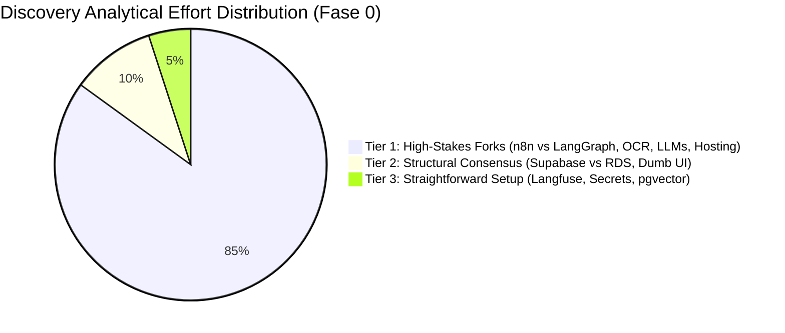

# Architectural Decision Matrix & Discovery Triage
**Context:** Indaiá Logística — MyINDAIA Platform Modernization Strategy  
**Date:** 2026-07-14  
**Scope:** Architectural Component Trade-offs, Benchmarking Agenda & 3-Tier Discovery Triage  
**Authoritative References:**
- [Target System Architecture (`target_architecture.md`)](target_architecture.md)
- [Technical Concerns & Risks (`concerns_and_questions.md`)](concerns_and_questions.md)
- [Discovery Plan v2 (`../../../03_Planning/Discovery_Prep/2026-07-06 Discovery Plan v2.md`)](../../../03_Planning/Discovery_Prep/2026-07-06%20Discovery%20Plan%20v2.md)

---

## Executive Summary

Given the 4-layer architecture defined in `target_architecture.md` (`FastAPI Monolith + n8n + Gemini/Docling + PostgreSQL`), the engineering implementation requires evaluating **10 major component choices** across 4 domains (`Cognitive/AI`, `Integration/Scraping`, `Data/Identity`, and `Frontend`).

Each component choice represents a trade-off between **Open-Source / Self-Hosted** (lower ongoing OpEx, complete LGPD and client data-residency control, higher SRE maintenance) and **Paid SaaS / APIs** (zero infrastructure maintenance, faster initialization, recurring subscription costs, and potential corporate data transit restrictions).

To maximize analytical leverage during **Fase 0 (Discovery)** alongside independent architecture reviewer **Rodrigo Zayit**, these 10 decisions are triaged into **3 Analytical Tiers**. Rather than distributing engineering attention equally, ~85% of analytical effort is concentrated on the **4 High-Stakes Architectural Forks (`Tier 1`)** that govern long-term cloud bills, internal team maintainability, and federal customs compliance.

---

## Part 1: The 3-Tier Discovery Analytical Triage

### Tier 1: The Critical Architectural Forks (`85% of Discovery Effort`)
These 4 decisions involve severe tensions between **Maintainability vs. Engineering Power**, **Extraction Accuracy vs. OpEx**, and **Cloud CapEx vs. Digital Certificate Hardware (`A1 vs A3`)**. A wrong decision here creates technical debt, budget overruns, or legal blockers.

| # | Component Area | Core Tension & Trade-off Analysis | Discovery & Zayit Action Plan |
|:---|:---|:---|:---|
| **#4** | **Cognitive State Engine** `n8n AI Nodes vs. LangGraph` | **Human Capital Maintainability vs. Engineering Power.** `LangGraph` provides native `Redis` checkpointing (`interrupt/resume` for Human-in-the-Loop), automated unit tests (`pytest`), and multi-step self-correction. **BUT** Wagner's internal team (`2.0IT` / Tech Ops) cannot easily debug Python state graphs. `n8n AI Nodes` allow visual maintenance, **BUT** complex cognitive loops can quickly turn into unmaintainable visual spaghetti (`Divergência 2`). | Implement one complex cognitive workflow (`Agent 02: Ingestão` or `Agent 05: Compliance LI`) in *both* `n8n` and `LangGraph` during Discovery to empirically establish where the visual workflow boundary breaks. |
| **#1** | **Document Parsing & OCR** `Docling/Self-Hosted vs. LlamaParse/Paid APIs` | **Extraction Accuracy vs. Monthly OpEx vs. Data Residency.** Indaiá processes ~30,000+ TEUs/year (`~450,000 pages/year`). Commercial APIs (`LlamaParse`, `AWS Textract` @ $0.003–$0.01/page) provide high out-of-the-box table accuracy, **BUT** add **$1,350–$4,500+/year** in ongoing OpEx and risk violating BASF/Nestlé data-residency clauses by routing invoices to US endpoints. `Docling/OpenDataLoader` runs locally inside private VPC (`$0 OpEx`), **BUT** must prove ~99% accuracy on multi-column Portuguese tables (`Concern 1`). | Benchmark `Docling` against `LlamaParse` across 50 historical, highly dense Indaiá commercial invoices and packing lists. |
| **#2** | **Primary LLM Provider** `Gemini 1.5 Pro/Flash vs. Claude 3.5 vs. DeepSeek/Qwen` | **Unit Cost vs. Reasoning Capability vs. Server Residency.** The largest ongoing software cost. Chinese models (`DeepSeek-V3 / Qwen 2.5`) cost **~1/10th** of frontier models while approaching parity, **BUT** routing Brazilian customs data to Chinese or US public endpoints poses legal compliance risks for multinational clients. Frontier models (`Gemini 1.5 Pro/Flash` or `Claude 3.5`) hosted inside AWS `sa-east-1` guarantee compliance but carry higher per-token costs. | Establish a **Multi-Tier Routing Strategy**: low-cost long-context models (`Gemini 1.5 Flash` or locally-hosted weights) for initial drafting/extraction, and frontier models (`Gemini 1.5 Pro` in `sa-east-1`) strictly for compliance validation (`Agent 04/05`). |
| **#5/#6** | **Integration & Scraping Hosting** `SaaS vs. Self-Hosted ECS + Certificate Blocker` | **Cloud CapEx/OpEx vs. Digital Certificate Hardware (`A1 vs A3`).** Self-hosting `n8n` + `Browserless.io` (`Option B`) on AWS ECS Fargate provides full VPC data isolation and zero SaaS execution caps, **BUT** running headless Chrome containers requires right-sized RAM/CPU to prevent AWS bill spikes. Furthermore, while software **A1 certificates (`.pfx/.p12`)** can be injected from `AWS Secrets Manager` into cloud scrapers (`Mercante/SDA`), if Federal Revenue enforces physical **A3 USB smartcard tokens**, cloud mTLS breaks (`Concern 3 / A3 Blocker`), requiring an on-premise signing gateway at Indaiá's Santos office. | Legal audit of client data transit rules (`Option A vs B`); right-size AWS ECS Fargate containers; empirically test `A1` software certificate conversion across `Mercante/SDA/Portal Único`. |

---

### Tier 2: Structural Consensus (`10% of Discovery Effort`)
These 3 choices shape the core architecture, but trade-off analysis is fast because a pragmatic consensus exists based on Indaiá's current prototypes and resource profile.

| # | Component Area | Proposed Baseline | Pragmatic Consensus & Rationale |
|:---|:---|:---|:---|
| **#7/#8** | **Primary Database & IdP** `Supabase vs. bare AWS RDS + Auth0/Clerk` | `Supabase` (Postgres 16 + Auth + Storage in AWS `sa-east-1`) | Wagner's internal team (`2.0IT`) built their prototype on `Supabase`. **Retain `Supabase` for Option A / Discovery** to preserve ~55–60% of their schema work and out-of-the-box `Postgres RLS`. Upgrade to bare `AWS RDS + Auth0/Clerk` (`Option B`) only if corporate clients (`BASF`) mandate turn-key SAML/SSO federation that `Supabase Auth` cannot support. |
| **#10** | **Frontend Prototyping Stack** `React + Shadcn UI + Tailwind vs. Next.js/SSR` | `React 18 + TS + Tailwind + Shadcn UI + React Query` ("Dumb UI") | Lock in the **"Dumb UI" pattern** to prevent any business logic from leaking into the frontend. Pure `React + Shadcn UI + Tailwind` allows internal junior/mid developers to vibe-code screens rapidly (`Cursor/v0`) while quarantining all tax/customs rules inside the Python `FastAPI` monolith (`Layer 2`). |

---

### Tier 3: Straightforward Engineering Choices (`5% of Discovery Effort`)
These 3 decisions require minimal trade-off analysis because the proposed baseline represents an undisputed industry best-practice for an SMB (~360 employees) seeking serverless operational simplicity.

| # | Component Area | Proposed Baseline | Why the Decision is Straightforward |
|:---|:---|:---|:---|
| **#3** | **LLM Observability & Tracing** | `Langfuse` (Open-source / OTel-native) | `Langfuse` integrates natively with both `n8n` AI nodes and `FastAPI` code via `OpenTelemetry`, has zero vendor lock-in, stores logs inside our own `PostgreSQL` instance, and avoids `LangSmith`'s expensive SaaS subscription tiers ($39–$249+/mo). |
| **#9** | **Secrets & Certificate Vault** | `AWS Secrets Manager` | Fully managed, serverless, handles automated encryption and certificate retrieval, and costs ~$0.40 per secret/month. Self-hosting `HashiCorp Vault` requires managing cluster unsealing and server patching—an unjustified operational burden for Indaiá. |
| **#7b** | **Vector Search Engine** | `pgvector` inside PostgreSQL 16 | Running `pgvector` inside our primary relational database eliminates the cost, latency, security overhead, and data synchronization headaches of paying for a secondary standalone vector database (`Pinecone`, `Qdrant`, or `Weaviate`). |

---

## Part 2: Complete 10-Decision Component Matrix

| # | Domain | Component Area | Proposed Baseline (`target_architecture.md`) | Leading Alternatives | Primary Decision Driver & Discovery Validation |
|:---|:---|:---|:---|:---|:---|
| **1** | Cognitive/AI | **Document OCR & Layout Parsing** | `Docling` / `OpenDataLoader` (Self-hosted) | `LlamaParse`, `AWS Textract`, `Google Document AI`, `Marker` | Cost at 450k pages/yr (`$0 vs $3k+/yr`) & table accuracy across multi-column Portuguese customs invoices. |
| **2** | Cognitive/AI | **Primary LLM Provider** | `Google Gemini 1.5 Pro/Flash` | `Anthropic Claude 3.5 Sonnet`, `OpenAI GPT-4o`, `DeepSeek-V3 / Qwen 2.5` | Cost per 1M tokens, 2M context window, and Brazilian/EU server data residency (`sa-east-1`). |
| **3** | Cognitive/AI | **LLM Observability & Audit** | `Langfuse` (Self-hosted / Cloud) | `LangSmith`, `Arize Phoenix`, `Helicone` | OpenTelemetry (`OTel`) native hooks across visual `n8n` workflows and Python `FastAPI` code. |
| **4** | Cognitive/AI | **Cognitive State Engine** | `n8n AI Nodes` + `Pydantic` | `LangGraph` (Python StateGraph + Redis checkpointing) | Visual maintainability for Wagner's Tech Ops vs. robust multi-step retry loops and `interrupt/resume` (`HITL`). |
| **5** | Integration | **Pipeline Orchestrator** | `n8n` (Self-hosted single container) | `n8n Cloud` SaaS, `Apache Airflow`, `Temporal`, `Make` | Legal audit of SaaS data transit vs. AWS ECS Fargate right-sizing. |
| **6** | Scraping | **Government Scraping Container** | `Playwright` via `Browserless.io` | `Selenium`, `Puppeteer`, third-party APIs, unofficial Siscomex parsers | Headless Chrome memory stability and **A1 `.pfx/.p12` certificate** injection on `Mercante/SDA`. |
| **7** | Data/Core | **Primary Database & Vector Store** | `AWS RDS PostgreSQL 16` + `pgvector` | `Supabase Postgres`, `Qdrant`, `Pinecone` | Retaining Wagner's `Supabase DB` (`55% code reuse`) vs bare `AWS RDS` migration. |
| **8** | Identity | **Identity Provider (`IdP`)** | `Auth0` / `Clerk` or `Supabase Auth` | `Keycloak`, `AWS Cognito` | Enterprise SAML/SSO requirement for corporate clients (`BASF/Nestlé/Pirelli`). |
| **9** | Security | **Secrets & Certificate Vault** | `AWS Secrets Manager` | `HashiCorp Vault`, `Infisical`, `Doppler` | Serverless zero-maintenance secret management replacing self-hosted `Vault`. |
| **10** | Frontend | **UI Prototyping Stack** | `React 18 + TS + Tailwind + Shadcn UI + React Query` | `Next.js` (Full-stack SSR), `Vue/Nuxt`, `HTMX` | Vibe-coding velocity (`Cursor/v0`) paired with strict "Dumb UI" enforcement. |
