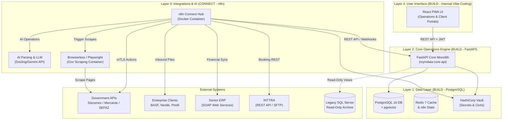

# Executive Summary: MyINDAIA Modernization Strategy

This document provides a high-level strategic overview of the **MyINDAIA Platform Modernization** project, designed for executive decision-making.

---

## 1. Rationale & Strategic Fit

Indaiá Logística is a Small-to-Medium Business (SMB) operating in a commoditized service industry (customs brokerage). In this market, technology serves two critical roles: driving operational efficiency and enabling customized B2B client integrations.

### The Problem: Legacy System Debt

* **Legacy Debt**: The legacy Delphi VCL desktop application and Classic ASP web portal are insecure (exposed backdoor `DOOMDOOM`, hardcoded credentials) and structurally fragile.
* **Talent Constraint**: The IT department is unaligned with modern techniques, and recruiting a team of specialized engineers (ML, DevOps, Frontend) to build and maintain a complex cloud microservices architecture is financially unfeasible.
* **Integrations Complexity**: High-value clients require custom data formats (Nestlé, Pirelli, BASF, Cebrace), meaning off-the-shelf SaaS comex platforms cannot be adopted without losing core differentiation and/or additional development.

### Business Impacts of the Status Quo (Keeping Legacy System As-Is)

Retaining the legacy platform is not a neutral, cost-free choice; it introduces escalating commercial and financial risks:

* **1. Catastrophic Compliance and Liability Risks (LGPD & Security)**: The database privilege escalation (`securityadmin` role for all users) and hardcoded `sa` passwords make MyIndaia a major target for ransomware and data exfiltration. A breach of sensitive B2B trade details (commercial invoices, tax declarations, client identifiers) would violate Brazilian LGPD regulations and lead to massive federal fines. Furthermore, multinational clients (BASF, Nestlé, Pirelli) enforce strict security audits and will terminate contracts immediately if their supply chain data is compromised.
* **2. Competitor Cost and Speed Advantages (AI Stagnation)**: In 2026, tech-forward customs brokers use AI agents to automate document ingestion and customs filings, processing clearances in minutes. By keeping manual, spreadsheet-driven operations, Indaiá's operational cost per shipment will remain high while processing speeds remain slow, leading to a loss of market share.
* **3. Severe Developer Bottleneck (Talent Scarcity)**: Delphi (VCL) and Classic ASP (VBScript) developers are virtually non-existent in the modern labor pool. Indaiá faces a single-point-of-failure risk: if key legacy personnel leave, the core system becomes unmaintainable, exposing the business to prolonged operational downtime.
* **4. Client Churn (Lack of Real-Time API Integrations)**: Modern enterprise clients require real-time webhook updates, API-driven milestones, and automated freight booking. The legacy system's tight coupling and lack of event-driven messaging make building new integrations slow and expensive, causing new prospects to choose modern digital-first competitors.
* **5. Regulatory Non-Compliance (DUIMP Transition)**: The Brazilian government is actively retiring the legacy DI (PGDI) system in favor of the Portal Único SISCOMEX's **DUIMP** standard. Keeping the legacy system as-is makes it highly complex to adapt to new regulatory formats, risking heavy customs fines, cargo holds, and broker license suspensions.

### Strategic Evolution Choices (Make vs. Buy Analysis)

Indaiá faces a critical choice on how to evolve its technological foundation. The options represent distinct trade-offs between cost, control, and differentiation:

| Option | Description | Trade-offs & Strategic Fit | Decision |
| :--- | :--- | :--- | :--- |
| **Option A: Status Quo** | Retain legacy Delphi/ASP platform. Attempt to patch security holes in-place. | **Pros**: Zero upfront CapEx. **Cons**: Critical security exposure, high risk of LGPD fines, scarce dev talent, operational stagnation, unable to leverage AI. | **REJECTED** (Commercially unviable) |
| **Option B: Pure "Buy"** | Migrate entirely to an off-the-shelf Brazilian Comex SaaS platform. | **Pros**: Low setup cost, vendor handles all regulatory updates (DUIMP, Mercante). **Cons**: **Loss of competitive differentiation**. Standard SaaS cannot accommodate custom B2B interfaces (EDI/XML) for key clients (BASF, Pirelli, Nestlé), leading to severe client churn. | **REJECTED** (Destroys B2B value prop) |
| **Option C: Pure "Make"** | Hire a full software team to custom-build a modern cloud-native microservices app. | **Pros**: Total control over IP, infinite scalability, custom AI features built in-house. **Cons**: **Prohibitively high cost**. Far exceeds Indaiá's CapEx/OpEx constraints. High operational complexity for a small IT team. | **REJECTED** (Financially unfeasible) |
| **Option D: Connect & Build (Hybrid)** | **The Selected Path**: Buy SaaS where standard; build a FastAPI Core; connect integrations via n8n and Gemini API. | **Pros**: Moderated CapEx/OpEx, retains full B2B customization, integrates modern AI/OCR without ML specialists, eliminates security risks. **Cons**: Requires managed orchestration and upskilled internal roles. | **SELECTED** (Optimal cost-benefit) |

### The Strategy: Connect / Build

Instead of a full custom build of a distributed microservices network (which would create a system Indaiá likely cannot afford to develop and maintain), we employ a **4-layer pragmatic architecture**:

1. **Buy/Managed (Security & Invoicing)**: Enlist managed SaaS for identity (Auth0/Clerk) and municipal NFS-e generation (eNotas), removing operational overhead.
2. **Connect (Integrations & AI - n8n)**: Automate B2B integrations, maritime bookings (INTTRA), government Playwright scrapers, and AI document OCR (Docling/OpenDataLoader + Gemini) visually using **n8n**. This layer implements the functions of the 10 agents proposed in the original v4 roadmap (such as Ingestion, Accuracy Verification, Allocation, and Booking) as visual workflows using native AI agent nodes, rather than writing custom Python microservices. n8n is strictly confined to transport, mTLS connection handshakes, format translations, and callbacks—no database write-rules or core validations live here.
3. **Build (Core Operations Engine - FastAPI)**: Construct a single, focused API monolith and PostgreSQL database. This holds all custom business rules, double-entry ledger calculations, DUIMP compliance schemas, and state transitions (`TFOLLOWUP`).
4. **Build (User Interface - React Vibe Coding)**: Build a custom React frontend internally using a **Dumb UI Pattern**. The React code is strictly presentational; it contains zero business, financial, or regulatory logic, preventing vibe-coded frontend bugs from corrupting transactional data.

---

## 2. Technical Architecture Summary

The target stack isolates custom business rules from integration volatility:

- **Layer 4 (UI)**: React PWA for Operator Dashboards and Client Portals (built internally via AI-assisted coding using a Dumb UI pattern).
- **Layer 3 (Integrations)**: n8n Cloud (Option A) or a right-sized single-instance Docker container without Redis queue mode (Option B), connecting to the Gemini API & deterministic PDF layout engines (Docling / OpenDataLoader) for OCR document extraction, and Browserless.io (headless Chrome for government portal scraping).
- **Layer 2 (Core API)**: A single custom Python FastAPI monolith (`myindaia-core-api`) running on AWS ECS Fargate.
- **Layer 1 (Database & Secrets)**: PostgreSQL 16 (with `pgvector` for semantic document search), Redis 7 (caching only; queue state removed by default to right-size), and **AWS Secrets Manager** (Managed, serverless secrets store replacing HashiCorp Vault).
- **Legacy Archive**: Legacy SQL Server database locked as read-only, queried via an ODBC view in the Core API for historical audit access.

---

## 3. Project Roadmap: 26-Week Greenfield Rewrite

We reject the Strangler Fig approach (running Delphi and Python concurrently with bidirectional database sync) due to high scaffolding waste (~18 weeks of discarded work) and synchronization data risks. The project follows a **Greenfield Rewrite** roadmap:

- **Stage 0: Security Hardening (W1–W2)**: Immediate rotation of legacy passwords, removal of the `DOOMDOOM` backdoor, and deployment of HashiCorp Vault.
- **Stage 1: Core Platform & n8n (W3–W8)**: Setup of AWS hosting, PostgreSQL database, managed auth realm, and n8n container.
- **Stage 2: Export Vertical & UI (W9–W14)**: React UI vibe-coding, Core API export endpoints, and n8n workflows for INTTRA bookings and B2B client pipelines (Nestlé, Pirelli, BASF).
- **Stage 3: Import Vertical, UI & AI OCR (W9–W14)**: React UI vibe-coding, Core API DUIMP endpoints, and n8n workflows for hybrid document parsing (Docling/OpenDataLoader + Gemini LLM) and government Playwright scrapers.
- **Stage 4: Financial & ERP (W15–W18)**: Vibe-coding Invoicing UI, Core API ledger constraints, and n8n workflows for eNotas and Senior ERP SOAP integrations.
- **Stage 5: Shadow Validation & Cutover (W19–W26)**: 4 weeks of read-only shadow-mode validation replaying live inputs, followed by a 2-week vertical hard cutover and legacy decommissioning.

---

## 4. [DRAFT TO REVIEW] Financial Investment & Resource Plan

### Project Roles & Responsibilities

To execute this 26-week roadmap, the project combines external technical expertise with internal resources:

- **External Senior Dev (Contractor)**: Expert backend engineer (Python, FastAPI, SQL). Builds Core API database schemas, ledger backend, and workflow state engine. Reviews and co-signs all frontend code merges affecting API integration or state.
- **Tech Operations Lead (Internal Hire / Upskilled Resource)**: Tech-savvy operations coordinator (n8n, SQL, prompt tuning). Builds n8n workflows, B2B pipelines, Gemini prompts, and monitors executions.
- **Internal UI Developer (Internal Hire / Upskilled Resource)**: Junior/mid developer using vibe coding (React, TS, Tailwind). Rapidly builds presentational screens against the Core API.
- **Domain Experts (Existing Staff)**: Senior customs analysts (Export/Import leaders) and the internal Financial Controller. Map business requirements, audit shadow logs, and execute User Acceptance Testing (UAT).
- **Project Sponsor (CEO)**: Fabricio (Executive oversight). Approves budgets, leads change management, and coordinates with B2B client IT.

---

### The Architecture & Cost Options (A vs. B)

To address the platform engineering run-cost contradiction, Indaiá must choose between two paths after establishing client security constraints:

#### **Option A: Managed SaaS & Serverless (Recommended)**
*Right-sizes the stack to eliminate self-hosted platform engineering. We drop n8n Queue Mode, self-hosted Vault, and self-hosted telemetry (Langfuse).*
*   **Infrastructure**: n8n Cloud (SaaS), AWS Secrets Manager (Serverless), Langfuse Cloud (SaaS).
*   **CapEx (Upfront)**: **R$ 190,000** (Standard build effort).
*   **OpEx (Monthly Run)**: **R$ 16,000/month** (Tech Ops Lead R$ 8k, Cloud & SaaS R$ 5k, Support Dev R$ 3k).
*   **Feasibility**: Requires that B2B clients (BASF, Nestlé, Pirelli) allow trade data to pass through SaaS clouds, and that operators use A1 (file-based) digital certificates.

#### **Option B: Private Cloud / Self-Hosted (SRE Supported)**
*Required if client contracts forbid external SaaS or if hardware-based A3 certificates are mandatory. Adds SRE support and on-premises gateway development to the budget.*
*   **Infrastructure**: Self-hosted single n8n container on AWS ECS, AWS Secrets Manager, and a local signing proxy gateway for physical A3 tokens (if needed).
*   **CapEx (Upfront)**: **R$ 220,000** (Adds R$ 30,000 for infrastructure as code, Terraform setup, and mTLS proxy configuration).
*   **OpEx (Monthly Run)**: **R$ 22,000/month** (Increases the External Dev/SRE retainer to R$ 8,000/mo to handle VM patching, database pruning, and IAM policies).

---

### Three Gating Facts to Establish Before Approval

Before approving the budget or starting execution, Fabricio must answer these three questions:

| Fact to Establish | Architectural Implication |
| :--- | :--- |
| **1. Client SaaS Restrictions** Do B2B client contracts restrict using managed n8n Cloud or Langfuse Cloud? | **A vs. B Choice**: If restricted, Option B (Self-hosted) is mandatory, increasing CapEx by R$ 30k and OpEx by R$ 6k/mo. |
| **2. A1 vs. A3 Certificates** Can operations use file-based A1 digital certificates, or are we forced to use physical A3 hardware tokens? | **mTLS Blocker**: A3 hardware tokens cannot run in serverless/cloud environments. If A3 is mandatory, we must build a dedicated physical on-prem signing client. |
| **3. Real Daily Transaction Volume** What is the exact daily process/booking volume? | **Right-sizing**: Confirms we can permanently drop complex queue architectures in favor of simple, single-instance runners. |

---

## 5. Change Management & Operational Readiness

Transitioning Indaiá's operational staff from **manual data entry to AI supervision** is critical to project success:

- **The Workflow Shift**: n8n + Docling/OpenDataLoader + Gemini automates the extraction of Commercial Invoices and Packing Lists, reducing manual typing by 80%. Analysts shift focus to **Exception Handling**—reviewing OCR confidence flags and validating LPCO compliance rules.
- **Training & Shadowing (Weeks 19–22)**: Analysts double-run active processes in Delphi and inspect the outputs inside the new React UI, building confidence in the AI results and training operational models before the hard cutover.
