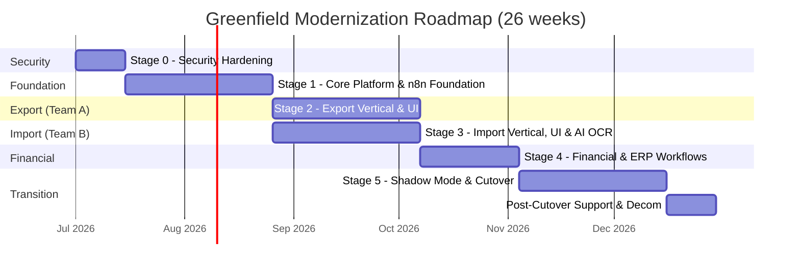
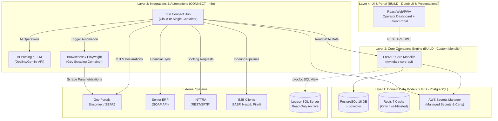

# Project Strategy & Modernization Roadmap

This document outlines the high-level strategy, execution timelines, architecture summaries, resource requirements, and change management protocols for the MyINDAIA Platform Modernization.

---

## 1. Selected Strategy: Greenfield Rewrite (~26 weeks)

Based on a detailed evaluation of Indaiá's operational needs and resource model, we have selected a **Greenfield Rewrite** as the execution path.

Under this strategy:
* We build the new Core Operations Engine (FastAPI) and the React UI independently of the legacy application.
* We connect integrations (B2B client pipelines, email/WhatsApp notifications, ERP sync, and AI document OCR) via **n8n**.
* We validate the new system in a read-only **Shadow Mode** by replaying operational inputs.
* We execute a vertical-by-vertical **hard cutover** (Export → Import → Financial), archive the legacy SQL Server database as read-only, and turn off the legacy Delphi modules.

### Why the Strangler Fig Approach Was Rejected
We previously evaluated an incremental **Strangler Fig Migration** (where the legacy Delphi app and the new Python backend run simultaneously with bidirectional database synchronization). This approach was rejected for three reasons:
1. **High Scaffolding Waste**: Building bidirectional database sync adapters, trigger-bypass controls in SQL Server, and conflict resolution queues requires ~18 weeks of extra engineering effort. This represents a **70% increase** in project timeline that would be completely discarded after cutover.
2. **Extreme Operational Risk**: Bidirectional data synchronization between SQL Server (running legacy triggers and procedures) and PostgreSQL is highly prone to split-brain states, sync loops, and data corruption. An SMB like Indaiá does not have the dedicated Platform/DevOps team needed to monitor and maintain this distributed state.
3. **Drastic Scope Reduction in Greenfield**: By using **n8n** for integrations and **vibe coding** (AI-augmented development) for the React UI, the Greenfield build time has been compressed to just **26 weeks**. The risk of a Greenfield approach is now extremely low compared to the massive technical debt of Strangler Fig coexistence scaffolding.

### Strategic Summary Table

| Dimension | Selected Path: Greenfield Rewrite | Rejected Path: Strangler Fig |
|---|---|---|
| **Total Timeline** | **26 weeks** (6 months) | ~44 weeks |
| **Coexistence Scaffolding** | **0%** (built directly to target state) | ~30% wasted effort (discarded after launch) |
| **Data Corruption Risk** | **Low** (single transactional database) | High (bidirectional sync, trigger loops) |
| **System Complexity** | Standard monolithic API + n8n | Distributed dual-database sync + API routing gateway |
| **Team Cognitive Load** | Focus entirely on the new stack | Must maintain Delphi, SQL Server triggers, and Python sync |
| **Security Exposure** | Legacy vulnerabilities retired in 26 weeks | Legacy vulnerabilities active for 44 weeks |

---

## 2. Implementation Timeline



---

## 3. Target Architecture (Summary)

The target system uses a clean 4-layer model that isolates custom business logic from integration volatility and user interfaces.



---

## 4. Project Staffing & Resource Model

To execute this 26-week roadmap, Indaiá requires a balanced resource model combining external technical expertise with internal roles.

### 4.1 Project Roles & Responsibilities
*   **External Senior Dev (Contractor)**: Expert backend engineer (Python, FastAPI, SQL). Builds Core API database schemas, ledger backend, and workflow state engine. Reviews and co-signs all frontend code merges affecting API integration or state. Under Option B, this role expands to include fractional DevOps/SRE platform administration (Terraform, secrets isolation, container setups).
*   **Tech Operations Lead (Internal Hire / Upskilled Resource)**: Tech-savvy operations coordinator (n8n, SQL, prompt tuning). Builds n8n workflows, B2B pipelines, Gemini extraction prompts, and monitors executions.
*   **Internal UI Developer (Internal Hire / Upskilled Resource)**: Junior/mid developer using vibe coding (React, TS, Tailwind). Rapidly builds presentational screens against the Core API following the Dumb UI pattern.
*   **Domain Experts (Existing Staff)**: Senior customs analysts (Export/Import leaders) and the internal Financial Controller. Map business requirements, audit shadow-mode logs, and execute User Acceptance Testing (UAT) to validate accounting arithmetic.
*   **Project Sponsor (CEO)**: Fabricio (Executive oversight). Approves budgets, leads change management, and coordinates with B2B client IT.

### 4.2 Staffing & Onboarding Schedule
*   **Weeks 1–2 (Stage 0)**: Recruit external candidates or select existing internal candidates for upskilling into the **Tech Operations Lead** and **Internal UI Developer** roles.
*   **Week 3 (Stage 1 Start)**: Onboard/assign both candidates. Setup development environments and secure access channels.
*   **Weeks 3–8 (Stage 1)**: The Tech Operations Lead undergoes intensive training shadowed by the external consultant (n8n courses, SQL basics, LLM prompt engineering).
*   **Weeks 9+ (Stage 2+)**: Hires/upskilled resources assume ownership of n8n flows and React UI building under the supervision of the External Specialist.

---

## 5. Project Budget & Cost Estimates

```
┌─────────────────────────────────────────────────────────────────┐
│                    PROJECT INVESTMENT ESTIMATE                  │
│                                                                 │
│   One-Time Development (CapEx)       Monthly Run Cost (OpEx)    │
│   ┌─────────────────────────────┐    ┌────────────────────────┐  │
│   │ Option A (SaaS):    R$ 190k │    │ Option A (SaaS): R$ 16k│  │
│   │ Option B (On-Prem): R$ 220k │    │ Option B (ROps): R$ 22k│  │
│   └─────────────────────────────┘    └────────────────────────┘  │
└─────────────────────────────────────────────────────────────────┘
```

### 5.1 Option A: Managed SaaS & Serverless (Recommended)
*Right-sizes the stack to eliminate self-hosted platform engineering (dropping n8n Queue Mode, self-hosted Vault, and self-hosted telemetry).*
*   **Upfront CapEx (26 Weeks)**:
    1. External Senior Developer: R$ 15,000/mo × 6 months = **R$ 90,000**
    2. Tech Operations Lead (Salary): R$ 8,000/mo × 6 months = **R$ 48,000**
    3. Internal UI Developer (Salary): R$ 6,000/mo × 6 months = **R$ 36,000**
    4. AWS Infrastructure & Training Tokens: **R$ 16,000**
    *   *Total Estimated Capital: R$ 190,000*
*   **Ongoing Monthly OpEx**:
    1. Tech Operations Lead (Internal staff): **R$ 8,000/mo**
    2. n8n Cloud, AWS Secrets Manager, Langfuse Cloud, & Cloud hosting: **R$ 5,000/mo**
    3. External Developer On-Call Support (8h/mo retain): **R$ 3,000/mo**
    *   *Total Estimated Monthly Run: R$ 16,000/month*

### 5.2 Option B: Private Cloud / Self-Hosted (SRE Supported)
*Required if client contracts forbid external SaaS or if hardware-based A3 certificates are mandatory. Adds SRE support and on-premises gateway development to the budget.*
*   **Upfront CapEx (26 Weeks)**:
    1. External Senior Developer: R$ 15,000/mo × 6 months = **R$ 90,000**
    2. Tech Operations Lead (Salary): R$ 8,000/mo × 6 months = **R$ 48,000**
    3. Internal UI Developer (Salary): R$ 6,000/mo × 6 months = **R$ 36,000**
    4. Infrastructure as Code (Terraform), CI/CD, and mTLS proxy build effort: **R$ 30,000**
    5. AWS Infrastructure & Training Tokens: **R$ 16,000**
    *   *Total Estimated Capital: R$ 220,000*
*   **Ongoing Monthly OpEx**:
    1. Tech Operations Lead (Internal staff): **R$ 8,000/mo**
    2. AWS Cloud Hosting, RDS database backups, & network transit: **R$ 6,000/mo**
    3. External Developer/SRE Retainer (40h/mo fractional DevOps/SRE support): **R$ 8,000/mo**
    *   *Total Estimated Monthly Run: R$ 22,000/month*

---

## 6. Change Management & Operational Transition

Replacing a 26-year-old system is primarily a **human transition**, not just a technical one. The project details clear guardrails to transition Indaiá's analysts.

### 6.1 From Data Typists to AI Supervisors
*   **The Shift**: Currently, customs analysts spend 80% of their day manually copying invoice line items into Delphi. In the new system, n8n + Docling/OpenDataLoader + Gemini extracts invoice data and drafts DUIMPs automatically.
*   **The Role**: Analysts are trained to become **AI Supervisors**. Their focus shifts to reviewing confidence flags, resolving discrepancies (mismatch logs), and approving finalized submissions.
*   **Training Program**:
    *   **Weeks 13–14 (Stage 2 End)**: Conduct hands-on workshops with export analysts using the new vibe-coded UI booking dashboards.
    *   **Weeks 19–22 (Stage 5 Shadow)**: Double-running validation phase. Analysts run active shipments in Delphi but manually inspect the shadow results in the React UI, reporting discrepancies. This builds user trust in the AI's accuracy before cutover.

### 6.2 Feedback Loop
When analysts fix an LLM OCR extraction error in the UI:
1.  The Core API logs the correct vs. incorrect value.
2.  The Tech Operations Lead reviews the log weekly.
3.  n8n Gemini extraction prompts are tuned to prevent recurrent errors.
