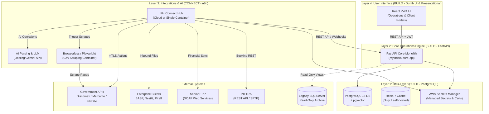
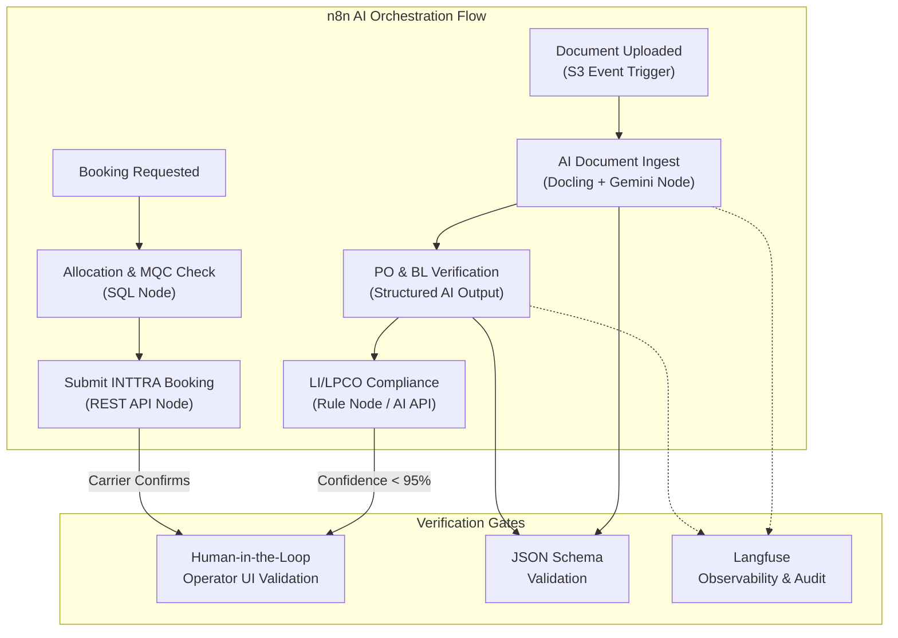
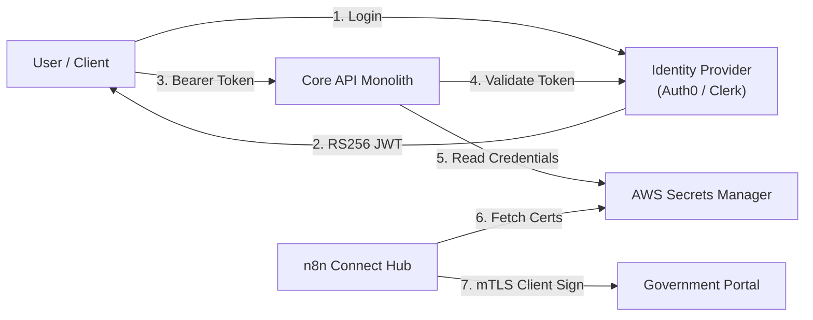

# Target System Architecture — MyINDAIA v2 (Greenfield)

This document describes the **target-state architecture** for the modernized MyINDAIA platform. This architecture is designed specifically to match Indaiá's resources: it consolidates custom business logic into a single monolithic API, leverages n8n for low-code integrations, and utilizes a custom React UI built internally using vibe-coding.

---

## 1. System Context

The new platform replaces all legacy components (Delphi VCL, Classic ASP, TMS XData, CEF4Delphi scrapers, BDE modules, ActiveX DLLs) with a unified, cloud-native stack. It maintains integrations with external systems via a dedicated connect layer.

---

## 2. Layer & Service Decomposition

Rather than deploying a complex network of 10 microservices, the system uses a highly maintainable 4-layer architecture.

### Layer 4: User Interface (React - Dumb UI Pattern)
A single frontend code repository (`myindaia-ui`) compiled into a React SPA.
* **Strictly Presentational**: Holds zero business logic, zero tax formulas, and zero compliance rules. It renders data returned by the API and posts user input back.
* **Operations Dashboard**: Interface for customs coordinators to manage active processes, inspect milestones, track deadlines, and override AI operations.
* **Client Portal**: Customer-facing dashboard allowing clients to track shipment statuses, download processed customs invoices, and upload raw trade files.
* *Development Method*: Vibe coding (AI-assisted rapid UI prototyping by internal developers).

### Layer 3: Integrations & Automations (n8n Hub - Transport Confined)
A managed n8n instance (n8n Cloud for Option A) or a right-sized single Docker container without Redis queue mode (Option B).
* **Transport and Integration Only**: Confined strictly to protocol translation, routing, mTLS client certificate presentation, retries, and callback events. No business logic or database write-rules reside here.
* **B2B Pipelines**: Automated flows that trigger when files are received via SFTP/FTP (Pirelli, Nestlé) or SOAP endpoints (BASF), parse data, and feed it to the Core API.
* **Maritime Bookings**: Interfacing with the INTTRA REST API for booking submissions and carrier confirmations.
* **ERP & Invoicing**: Exporting billing events to the municipal NFS-e SaaS (eNotas) and posting finalized invoices to Senior ERP SOAP web services.
* **AI OCR & Document Verification**: Flows that process incoming files through deterministic parsers (Docling/OpenDataLoader) and query Gemini API to extract fields, run validation schemas, and update process statuses.
* **Government Scraping**: n8n workflows that trigger headless Chrome containers (Browserless.io) to extract customs data from Mercante and SDA.

### Layer 2: Core Operations Engine (FastAPI Monolith - Rule Owner)
A single custom Python FastAPI backend (`myindaia-core-api`) running as an auto-scaling ECS Fargate task.
* **Business & Financial Truth**: Holds all custom business rules, double-entry financial logic, calculations, and official tax mappings.
* **Process Engine**: Core CRUD operations, container mappings, and customs details.
* **Workflow State Machine**: Implements the `TFOLLOWUP` event progression and `TCLIENTE_SERVICO` configurations. Reroutes processes, assigns operators, and calculates SLA deadlines.
* **Billing Ledger**: Double-entry ledger recording all financial settlements, check registries, and customs broker funds (SDA).
* **Reference Proxy**: Provides read-only SQL Server connections (via `pyodbc` Views) to access 26 years of historical DI data.

### Layer 1: Data Model (PostgreSQL + Redis + Secrets Manager)
* **PostgreSQL 16**: Primary relational database containing operations schemas, client configurations, vector document embeddings (`pgvector`), and immutable audit trails.
* **Redis 7**: Used only if self-hosted (Option B) for rate-limiting and temporary caching, otherwise deferred to minimize operational overhead.
* **AWS Secrets Manager**: Managed, serverless secrets store replacing self-hosted HashiCorp Vault. Stores DB passwords, API keys, and client mTLS certificates.

---

## 3. AI & Automation Layer (n8n + Docling/OpenDataLoader + Gemini)

The automation of 80% of operational tasks is achieved by orchestration flows defined visually in **n8n** utilizing native AI agent nodes, rather than writing raw Python code.

### Design Principles
* **Human-in-the-Loop**: Every automated draft (DUIMP, DU-E, LPCO, Invoices) remains in a "pending" state in the Core API. No transaction is submitted to government portals without manual approval from a licensed broker using a digital A3 certificate.
* **Confidence Gating**: The n8n document processing node compares the LLM's confidence score against a 95% threshold. Any shortfall flags the process in the Core database, blocking automation and highlighting fields in the React UI for analyst verification.
* **Observability (Langfuse)**: LLM calls made by n8n are integrated with **Langfuse** to maintain audit logs of prompt versions, execution costs, and response latencies.

### Agent Evolution: v4 LangGraph Agents to Modernized n8n Flows

The 10 autonomous agents proposed in the v4 original roadmap (initially planned as custom Python/LangGraph microservices) have been consolidated and mapped directly into the visual n8n workflow integrations to reduce maintenance overhead and accelerate development:

| Original v4 Agent | Modernized n8n Workflow Equivalent | Implementation Details |
| :--- | :--- | :--- |
| **Agent 01: Orquestrador** | **n8n Orchestration Flows** | Visual n8n workflow triggers and callback check-ins managing state progression and execution queues, eliminating Python state graphs. |
| **Agent 02: Ingestão Documental** | **AI Document Ingest & OCR** | S3-triggered n8n workflow combining layout parsers (Docling/OpenDataLoader) and Gemini LLM nodes to extract structured JSON data from uploaded trade documents. |
| **Agent 03: Verificação de Acuracidade** | **PO-to-Invoice Verification** | n8n workflow comparing PO line items against extracted invoice details and checking weights between Packing List and Bill of Lading. |
| **Agent 04: Classificação NCM** | **Historical NCM Matcher** | n8n database nodes querying 26 years of historical NCM logs to validate and suggest classification mappings. |
| **Agent 05: Compliance / Órgãos Anuentes** | **LPCO Compliance Checker** | n8n nodes querying Siscomex/Portal Único APIs to map NCMs to regulatory licensing requirements (Anvisa, MAPA, Inmetro). |
| **Agent 06: Rastreamento Logístico** | **Milestone & Channel Tracker** | Hourly cron workflows polling Mercante and Portals via Playwright scrapers (Browserless.io) and updating Core API followup statuses. |
| **Agent 07: Emissão Documental** | **DU-E XML Compiler & Drafts** | n8n XML mapping workflows compiling export invoices into WCO DU-E drafts, stored in PostgreSQL for human A3 sign-off. |
| **Agent 08: Comunicação** | **Notification & Alerts Pipeline** | Event-triggered n8n nodes generating and routing automated updates and alerts via WhatsApp/Email to clients and staff. |
| **Agent 09: Booking Marítimo** | **AI Booking Route Optimizer** | n8n flow interfacing directly with the INTTRA REST API for booking submissions and managing carrier fallback routing. |
| **Agent 10: Gestão de Allocation / MQC** | **Allocation & MQC Monitor** | Scheduled database querying node tracking TEUs targets from Active contracts (`TBID`) and routing alerts on deficit projections. |

---

## 4. Database Schema Structure

### PostgreSQL 16 (RDS)
A single RDS PostgreSQL database manages the production transactions:

| Schema Area | Key Tables | Purpose |
|---|---|---|
| **Core Operations** | `process`, `process_export`, `process_import`, `followup_event`, `followup_stage` | Process lifecycles, milestone completions, operator ownerships |
| **Workflow Config** | `client_service_config` | Per-client service stage overrides and operator assignments |
| **Clients & Identity** | `auth_user`, `customer`, `representative`, `broker` | Credentials (migrated to Argon2id), client profiles, representatives |
| **Documents** | `document`, `document_embedding` (pgvector) | File metadata, OCR JSON structures, semantic document search vectors |
| **Customs Declarations** | `duimp_declaration`, `due_declaration`, `li_license`, `lpco_permit` | Drafts and results of regulatory filings |
| **Financial Ledger** | `ledger_entry`, `bank_reconciliation`, `wallet_balance` | Invoicing summaries, bank statement matches, SDA broker wallets |
| **Audit Log** | `audit_trail` | Immutable records of database writes (actor, timestamp, IP, delta payload) |

### Redis 7
Runs on AWS ElastiCache. It holds:
* n8n execution states and task execution cues.
* Caches of slow-moving registry tables (NCM codes, ports, cities).
* User session buckets.

### Legacy SQL Server (`BROKER`)
Retained strictly as a **read-only historical archive**. The Core API connects via a read-only ODBC bridge (`BROKER_PYODBC_RO`) to present historical views to the React UI, eliminating the need to execute massive database migrations.

---

## 5. Security & Authentication Model

### Identity and Access Control
* **Managed Auth**: Identity is managed via a cloud-based Identity Provider (such as Auth0 or Clerk), removing the need to host and patch Keycloak.
* **JWT Authentication**: The React frontend attaches an RS256-signed JWT to API requests. The Core API validates the signature and reads roles.
* **Secrets Isolation**: All database passwords, API tokens (Gemini, eNotas), and private government mTLS certificates are stored in **AWS Secrets Manager**, which requires zero VM-level maintenance.
* **mTLS Integration & The Certificate Constraint**:
  * **Outbound mTLS**: Workflows presenting client certificates to government APIs (Siscomex/Mercante) fetch software-based **A1 certificates** (`.p12` / `.pfx` files) from AWS Secrets Manager and perform outbound mTLS calls directly.
  * **The A3 Hardware Token Blocker**: A3 certificates reside on physical USB tokens or smartcards. They **cannot** be loaded into serverless environments or standard cloud containers. If Indaiá is legally forced to use physical A3 tokens for certain filings, the system requires an **on-premises signing gateway** connected to the hardware devices to handle local signature generation. Converting automated actions to A1 file-based certificates is the primary target.

---

## 6. Frontend Architecture (React)

The frontend is a single-page application built with React, compiled into a progressive web app (PWA).

| Technology | Role | Advantage for Vibe Coding |
|---|---|---|
| **React 18 + TS** | UI Component Framework | Extensive component libraries, strict type safety |
| **Tailwind CSS** | Design styling | Utility classes enable rapid styling and responsive layout builds |
| **Shadcn UI** | Component primitive kit | Pre-built accessible components, easily customized via prompt coding |
| **React Query** | Server state syncing | Automatic caching, polling, and UI synchronizations |
| **Zustand** | Lightweight client state | Simple global state (sidebar toggles, user preferences) |
| **PDF.js** | Document previews | In-browser document annotation and OCR comparison |

---

## 7. Technology Stack Summary

| Layer | Modernized Stack | Replaces Legacy |
|---|---|---|
| **Programming Language** | Python 3.12 (Core API) | Delphi/Object Pascal, VBScript (ASP) |
| **API Framework** | FastAPI | TMS Sparkle / XData |
| **Integration Platform** | n8n (self-hosted Docker) | Delphi Custom EDI, Borland DB Engine (BDE) |
| **AI Orchestration** | n8n AI Nodes + Docling/OpenDataLoader + Gemini API | Manual data entry and Excel mappings |
| **Observability** | Langfuse (n8n plugin) | None |
| **Browser Automation** | Playwright (Browserless.io container) | CEF4Delphi, IE TWebBrowser scraping |
| **Invoicing Engine** | Municipal Invoicing SaaS (eNotas/Focus) | ACBr, DDENFSe.dll city-specific formats |
| **ERP SOAP Client** | n8n SOAP Node / Python `zeep` | Delphi WSDL-generated SOAP classes |
| **Identity Provider** | Auth0 / Clerk (Managed OIDC) | SQL Server native logins, WM_COPYDATA IPC |
| **Secrets Engine** | HashiCorp Vault | Plaintext configurations, registry keys, .ini files |
| **Primary Database** | PostgreSQL 16 + pgvector | SQL Server (`BROKER` write access) |
| **Cache & Queue** | Redis 7 | Local Delphi timer threads |
| **Frontend Framework** | React 18 + Tailwind | Delphi VCL forms, Classic ASP tables |
| **Hosting Infrastructure** | AWS ECS Fargate, RDS, ElastiCache | Local on-premises servers, IIS hosts |
