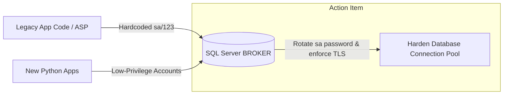

# Plan Stage 0: Security & Immediate Credentials Hardening

* **Timeline**: Weeks 1–2
* **Resource Allocation**: Shared task (Time A and Time B)
* **Goal**: Remediate critical security vulnerabilities in production, establish database access controls with minimum privilege, and build a secure digital key vault for government integrations.

---

## 1. Urgent SQL Server Hardening

The current system relies on a single administrative login (`User ID=sa;Password=123`) hardcoded in source code files, desktop settings, and web configurations. This represents a severe operational risk.



### Action Items
1. **Rotate the `sa` Password**: Change the `sa` administrative account password on the database server `INDAIA10`. Disable external connections to port 1433, restricting database access exclusively to the local VPC.
2. **Privilege Escalation Remediation (`sp_inclui_login`)**: Rewrite the `sp_inclui_login` stored procedure. Run a script to immediately revoke `db_owner` and `securityadmin` roles from all existing standard user accounts, assigning them `db_datareader/db_datawriter` instead.
3. **Backdoor & Hardcoded Auth Removal**: Immediately delete the `DOOMDOOM` backdoor bypass in the public `logon.asp` page. Rotate the exposed `789852` SMTP password in `logon.asp` and the AWS SES credentials.
4. **Create Minimum-Privilege Accounts**: Create dedicated, restricted database accounts to replace administrative logins:
   * `MYINDAIAWEB_RO`: Read-only access to view schemas in `BROKER` and `MYINDAIAV2`. Used to update connections on the legacy web portal.
   * `BROKER_PYODBC_RO`: Read-only access for the new Python Core API to read historical process data, follow-up events, and tracking metadata.
5. **Decouple Code Configs**: Map and remove all instances of hardcoded credentials. Update configurations to load DB parameters from environment variables (Python) and secure local `.ini` configuration files with restricted ACL permissions (Delphi).
6. **JWT & API Hardening**: Replace the hardcoded 48-bit JWT secret (`2d013705c915`) with a 256-bit cryptographically secure key. Enforce token expiration (`exp` claims) across all REST APIs.
7. **Webhook Hardening**: Secure `myindaia-duimpwebhook`. Place it behind TLS (HTTPS) and stop writing the secret payload (`chave.txt`) to disk before validating the signature.

---

## 2. Hardening desktop SSO IPC (`WM_COPYDATA`)

The desktop login manager `mylogin` broadcasts credentials across the operating system using plain `WM_COPYDATA` messages, making passwords vulnerable to interception by other local processes.

### Remediation Plan
1. **Named Pipes Transition**: Replace plain `WM_COPYDATA` window message broadcasts with a local secure Named Pipe (`\\.\pipe\MyLoginPipe`).
2. **Access Control Lists (DACL)**: Apply a Windows Security Descriptor to the Named Pipe, allowing connection permissions only to processes running under the same user session or specific administrative accounts.
3. **Client Authentication**: Implement client process validation at the pipe connection boundary. Before transmitting credentials, verify the caller's process executable path and digital signature via the Win32 API (`GetWindowThreadProcessId` and `OpenProcess`).

---

## 3. Securing Digital Certificates & mTLS Proxy

The platform coordinates with Brazilian government systems (Siscomex, Portal Único, CE-Mercante) using client digital certificates (Vanessa, Fabricio, Edgar, etc.). These private key files currently reside unencrypted on local disks.

```
┌────────────────────┐      1. Request DU-E PDF      ┌──────────────────────┐
│  Core Backend API  ├──────────────────────────────>│ Playwright Service   │
└────────────────────┘                               └──────────┬───────────┘
                                                                │
                                                                │ 2. Fetch Vanessa.pem
                                                                ▼
┌────────────────────┐                               ┌──────────────────────┐
│ HashiCorp Vault    │<──────────────────────────────┤  mTLS Client Proxy   │
│ (Private Keys)     │      3. Certificate PEM/KEY   │     (HAProxy)        │
└────────────────────┘                               └──────────┬───────────┘
                                                                │
                                                                │ 4. Authenticated TLS
                                                                ▼
                                                     ┌──────────────────────┐
                                                     │ Portal Unico SEFAZ   │
                                                     └──────────────────────┘
```

### Decoupled Certificate Security Plan
1. **Secrets Vault Setup**: Deploy **HashiCorp Vault** within the secure AWS private subnet. Create policies that restrict certificate access to specific application identity roles.
2. **Move Keys to Vault**: Relocate all `.pem` and `.key` certificate files from local directories to Vault. Ensure keys are never stored on local disks or included in Git repositories.
3. **Delegate mTLS Handshakes**: Set up a local containerized proxy (such as HAProxy or Envoy) configured as a sidecar alongside Playwright and API containers. 
   * When a crawler or REST worker requests a government page, it routes the connection through the local proxy.
   * The proxy fetches the broker's certificate from Vault using temporary credentials and manages the mTLS handshake with SEFAZ/Siscomex dynamically.
   * Private keys are kept in memory and are never exposed to Python application code or disk storage.
4. **Enforce SSL Server Verification**: Modify all HTTP clients to enable peer verification (`VerifyMode := [sslvrfPeer]` in Delphi integrations, and `verify=True` in Python `httpx` setups), ensuring connection security and preventing MitM attacks.

---

## 4. Resource Allocations & Responsibilities

| Role | Key Deliverables | Estimated Effort |
|---|---|---|
| **External Specialist** | <ul><li>Rotate `sa` passwords and configure firewall ports.</li><li>Harden `sp_inclui_login` and clean standard logins permissions.</li><li>Delete `DOOMDOOM` backdoor, rotate SES/SMTP credentials, and secure webhooks.</li><li>Deploy Vault and HAProxy container templates.</li></ul> | 60 hours |
| **Legacy Developer** | <ul><li>Update Delphi desktop application to load secured local `.ini` files.</li><li>Harden `mylogin` SSO transition from WM_COPYDATA to Named Pipes with caller validations.</li><li>Configure Delphi components to enforce peer SSL verification.</li></ul> | 40 hours |
| **CEO / Sponsor** | <ul><li>Approve credentials rotation schedule and coordinate off-peak downtime window with operations staff.</li></ul> | 4 hours |

