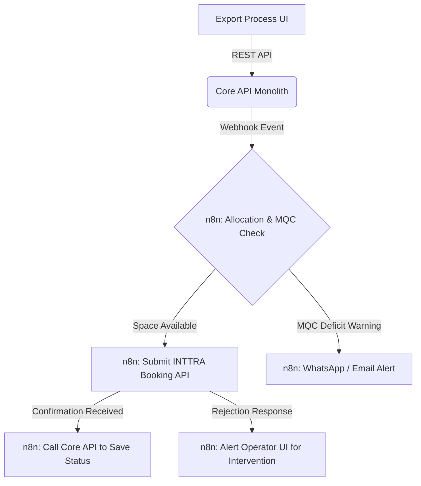

# Plan Stage 2: Export Operations & UI

* **Timeline**: Weeks 9–14
* **Resource Allocation**: Team A (Export Squad)
* **Goal**: Build the Export Operator React UI, implement corresponding Core API endpoints, automate the INTTRA maritime booking pipeline using n8n, and deploy the 11 legacy B2B client data pipelines directly into n8n workflows.

---

## 1. INTTRA REST API Integration (via n8n)

The legacy Delphi app relies on fragile Chromium browser automation (`minibrowser.pas` RPA) for booking operations. In Stage 2, this is replaced by official REST API and SFTP integrations configured visually as **n8n workflows**.



### Action Items
1. **API Credentials Provisioning**: Query INTTRA endpoints (`DraftEndFtpHomologacao`, `DraftEndFtpProducao`) using mTLS credentials fetched from HashiCorp Vault.
2. **n8n Integration Flow**: Build the booking request workflow in n8n. The flow is triggered by a Core API webhook when an export process is marked "Ready to Book."
3. **SFTP Response Parser**: Set up an n8n SFTP poll trigger to periodically fetch booking confirmation files (IFTMIN/IFTMAN EDI files), parse the content, and call the Core API's `/api/v1/export/{id}/confirm` endpoint.

---

## 2. Booking & Allocation Management (n8n AI Workflows)

We model the booking and carrier allocation logic as an n8n AI Workflow, utilizing native SQL and AI nodes.

### Allocation & MQC Monitor (Visual Flow)
* **Trigger**: Process creation, schedule changes, or weekly timers in n8n.
* **Database Query**: n8n executes a PostgreSQL query to retrieve active shipping contracts (`TBID`) and calculate monthly container targets (TEUs) per carrier.
* **SLA Target Calculation**:
  $$\text{MQC Target} = \frac{\text{TEUs Shipped}}{\text{Committed Contract Volume}} \times 100$$
* **Severity Alerts**: If a carrier commitment is projected to fall short (deficits at 30 days, 14 days, or critical target misses), n8n sends visual notifications to the React UI dashboard and triggers an alert via WhatsApp/Email to the commercial coordinator.

### AI Booking Route Optimizer
* **Trigger**: A new booking request is sent to the n8n flow.
* **Decision Node**: An n8n AI node assesses carrier contract constraints and target shortfalls. It recommends the carrier with the highest shortfall risk to consume the allocation.
* **Failover Routing**: If INTTRA returns a carrier rejection, the flow automatically references contract parameters, selects the next optimal carrier, and pushes the new draft to the operator's React UI for approval.

---

## 3. DU-E Emissão Documental

* **Trigger**: Process marked "Documents Complete" in the Core database.
* **Automated XML Compilation**: An n8n workflow reads export invoice data from the Core API (`TPROCESSO_EXP` mapping), parses container specifications, and generates WCO-compliant XML payloads.
* **Human-in-the-Loop Sign-off**: The generated XML payload is stored in the PostgreSQL database as a draft. The export coordinator reviews the draft in the React UI and signs it using their A3 digital certificate, sending it to the government Portal Único.

---

## 4. B2B Client Integrations (n8n Connect)

The 11 legacy client integrations are migrated directly to n8n workflows, eliminating the need to write custom Python microservices.

```
┌───────────────────────────────────────────────────────────────┐
┌──────────────────┐      1. File Received       ┌─────────────┐│
│   Client SFTP    ├────────────────────────────>│  n8n Flow   ││
└──────────────────┘                             └──────┬──────┘│
                                                        │       │ Layer 3:
                                         2. Parse File  │       │ n8n Connect
                                         & Map Schema   ▼       │
┌──────────────────┐      3. REST Call           ┌─────────────┐│
│  Core Monolith   │<────────────────────────────┤  SQL Node   ││
│  PostgreSQL DB   │                             └─────────────┘│
└──────────────────┘                                            │
└───────────────────────────────────────────────────────────────┘
```

### Inbound Client Pipeline Rollout
* **Nestlé (FTP Excel Files)**: An n8n workflow triggers on new Excel files in Nestlé's FTP folder, parses rows, validates fields, and posts processes to the Core API.
* **Pirelli (SFTP CSV Files)**: An n8n workflow polls Pirelli's SFTP folder, converts CSV fields to JSON, and updates container status logs in the database.
* **BASF (SOAP XML API)**: n8n SOAP nodes receive XML files, map data structures, and invoke Core API endpoints.
* **Cebrace (SAP REST)**: n8n REST nodes receive JSON inputs directly from Cebrace's SAP systems.
* **Shared Folder Migrations**: Unsecure local network folders (`C:\DDBroker\`) are migrated to AWS S3. Clients deposit files into private buckets, triggering n8n flows immediately on upload events.
* **Legacy EDI Parser**: The 1.6MB Delphi parser (`Main.pas`) is replaced by an n8n parser workflow, using standard visual data transformation nodes to ingest cargo data.

---

## 5. Resource Allocations & Responsibilities

| Role | Key Deliverables | Estimated Effort |
|---|---|---|
| **External Senior Dev** | <ul><li>Develop Core API Export CRUD endpoints, container mapping models, and process logs.</li><li>Expose SQL schemas for carrier contract data (`TBID`).</li><li>Establish webhook trigger handlers to signal n8n integrations.</li></ul> | 80 hours |
| **Internal UI Developer** | <ul><li>Vibe-code Export Operations dashboards, Booking consoles, and MQC target graphs in React.</li><li>Hook frontend components to the Core API REST endpoints.</li></ul> | 120 hours |
| **Tech Operations Lead** | <ul><li>Construct B2B integration workflows (Nestlé, Pirelli, BASF, Cebrace, S3 uploads) in n8n.</li><li>Build INTTRA booking submit and SFTP response fetch workflows in n8n.</li><li>Build MQC target calculations and alert pipelines.</li></ul> | 180 hours |
| **Export Lead Analyst** | <ul><li>Provide raw data samples and field mappings for Nestlé, Pirelli, and BASF.</li><li>Test booking triggers and validate final DU-E XML drafts before approval sign-offs.</li></ul> | 40 hours |

