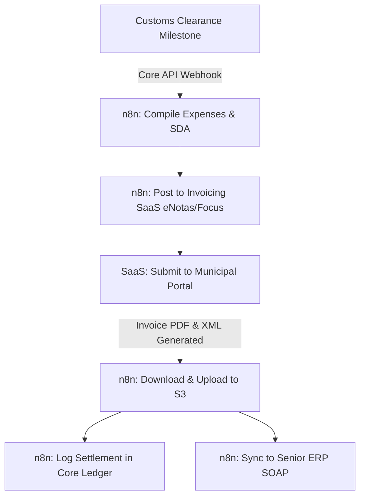

# Plan Stage 4: Financial & ERP Workflows

* **Timeline**: Weeks 15–18
* **Resource Allocation**: Shared task (both teams converge)
* **Goal**: Implement financial ledgers in the Core API, configure the vibe-coded Invoicing UI, automate municipal NFS-e generation via SaaS integrations in n8n, and connect billing results to Senior ERP SOAP web services using n8n.

---

## 1. Monolithic Invoicing Ledger & NFS-e SaaS (via n8n)

The billing calculations and ledger logs are managed by a focused financial module inside the Core API monolith. Municipal NFS-e generation is offloaded to a specialized billing SaaS (eNotas or Focus NFe) via n8n.

### Action Items
1. **Billing Endpoints**: Establish endpoints in the Core API (`myindaia-core-api`) to track process billing items, expenses, and check registries.
2. **NFS-e Automation (n8n)**: Build an n8n workflow that triggers when a process is marked "Clear for Billing". The flow compiles invoice details, formats the JSON payload, and posts it to the municipal invoicing SaaS API.
3. **PDF Ingest (n8n)**: The invoicing SaaS returns webhooks with generated invoice XMLs and PDFs. n8n catches these webhooks, saves the files to S3, and calls the Core API to update process records.

---

## 2. Senior ERP SOAP Integration (via n8n)

The legacy Delphi app uses WSDL-compiled SOAP proxies with hardcoded admin logins to post titles to Senior ERP. In Stage 4, we rebuild this using n8n SOAP nodes and Vault.

### Action Items
1. **SOAP Node Configuration**: Set up n8n workflows using the native SOAP node to interface with Senior ERP's WSDL endpoints (`AtualizarTitulosProcessos`).
2. **Credentials Isolation**: Config credentials inside HashiCorp Vault. The n8n workflow queries Vault to retrieve temporary SOAP access keys, isolating secrets from the workflow files.
3. **Data Mapping Node**: An n8n JSON-to-XML transform node validates process codes, values, and client CNPJs against the ERP's master tables before posting, reducing transactional discrepancies.

---

## 3. Wallet & Ledger Migration

The legacy system manages customs broker funds (SDA) and wallets across multiple tables (`PGCH` and `PGPG` modules).

### Action Items
1. **Database Schema Porting**: Migrate legacy wallet tables into the PostgreSQL database. Design constraints to enforce double-entry bookkeeping rules for all ledger inserts.
2. **One-Time ETL Migration**: Build a Python script to execute a one-time ETL migration of active client wallet balances and transaction histories during the Stage 5 cutover window.
3. **Audit Trail Logs**: Establish database triggers in PostgreSQL to automatically write every change to the `audit_trail` table, logging the actor (operator or n8n workflow ID), timestamp, client IP, and changes.

---

## 4. Resource Allocations & Responsibilities

| Role | Key Deliverables | Estimated Effort |
|---|---|---|
| **External Senior Dev** | <ul><li>Develop Core API billing database schemas, ledger tables, and constraints.</li><li>Deploy double-entry verification SQL logic.</li><li>Create PostgreSQL audit triggers for write operations.</li></ul> | 60 hours |
| **Internal UI Developer** | <ul><li>Vibe-code React UI dashboards for Invoicing, Wallet statements, and check registries.</li><li>Hook frontend billing panels to Core API ledger endpoints.</li></ul> | 80 hours |
| **Tech Operations Lead** | <ul><li>Build eNotas/Focus NFe SaaS integration workflows in n8n.</li><li>Build Senior ERP SOAP title update workflows in n8n.</li><li>Develop the wallet migration script for the cutover phase.</li></ul> | 120 hours |
| **Financial Coordinator** | <ul><li>Verify Senior ERP SOAP data payload contracts.</li><li>Audit calculated taxes against municipal regulations.</li><li>Validate ledger entries and check bank reconciliation runs.</li></ul> | 30 hours |

