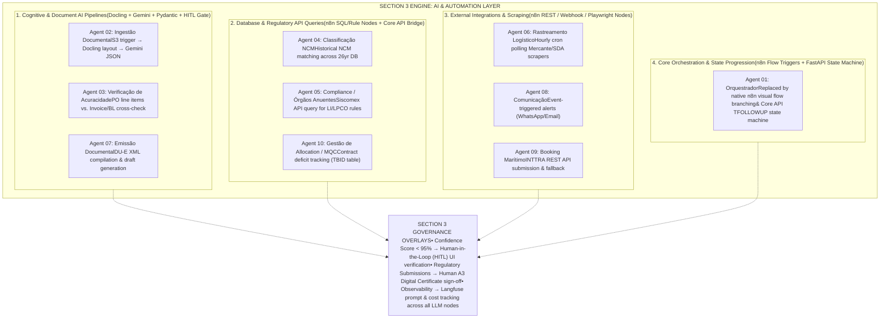
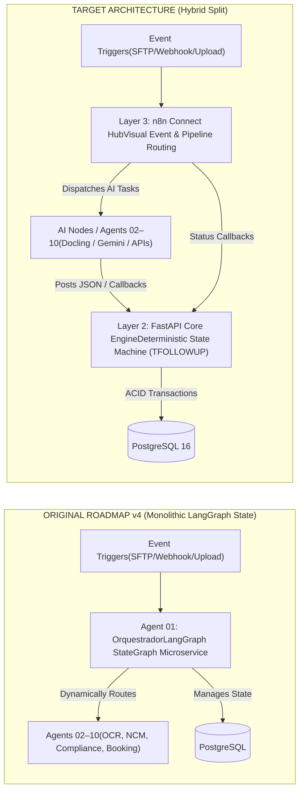

# Architectural Analysis: Agent Evolution & Orchestration Mapping

**Context:** Indaiá Logística — MyINDAIA Platform Modernization Strategy**Date:** 2026-07-14**Status:** Internal Technical Rationale & Alignment Bridge**Reference Documents:**

- `01_Strategy_and_Design/target_architecture.md` (Target System Architecture — MyINDAIA v2 Greenfield)
- `Roadmap v2/Especificacao_10_Agentes_IA_COMEX_v2.md` (Original 10 AI Agents Specification)
- `Comparison Internal System Indaia x Rolfilho/Assessment_Rolfilho_vs_INDAIA Perguntas.md` (INDAIA Internal Assessment — Divergência 2)

---

## Executive Summary

This document synthesizes the architectural mapping between the **10 autonomous agents originally proposed in Roadmap v4 (`LangGraph` microservices)** and the **modernized target architecture (`n8n + Docling/OpenDataLoader + Gemini + FastAPI + PostgreSQL`)** described in `target_architecture.md`.

It addresses two foundational questions:

1. **Functional Mapping:** How does Section 3 (`AI & Automation Layer`) relate to `Agent Evolution`? Where do the 10 conceptual v4 agents physically reside in the new architecture?
2. **Orchestration Architecture:** What happened to `Agent 01: Orquestrador`? How does multi-agent orchestration work when transitioning from a monolithic Python state graph (`LangGraph`) to a hybrid `n8n + FastAPI` execution model?

### Core Architectural Shift

Instead of building 10 isolated, code-first Python/LangGraph microservices that manage their own state and persistence, the target architecture **absorbs all 10 functional domains** into a **4-layer hybrid platform**:

- **Layer 2 (`FastAPI Core Monolith`)** owns deterministic business rules, legal customs state (`TFOLLOWUP`), financial ledgers, and ACID database transactions.
- **Layer 3 (`n8n Connect Hub`)** owns asynchronous event dispatching, visual workflow routing, external protocol translation, and AI node orchestration (`Docling + Gemini`).
- **Layer 1 (`PostgreSQL 16 + pgvector`)** centralizes data models, document embeddings, and immutable audit logs.

---

## Part 1: The 10-Agent Functional Mapping (MECE Categorization)

To ensure a Mutually Exclusive and Collectively Exhaustive (`MECE`) architecture, the 10 original v4 agents are categorized into **4 execution mechanisms** within the Section 3 engine:

### Complete Implementation Mapping Table

| #      | Original v4 Agent                  | Execution Mechanism       | Modernized Target Architecture Implementation (`target_architecture.md`)                                                                                                                          | Safety & Governance Gate                                                                                                         |
| ------ | ---------------------------------- | ------------------------- | ------------------------------------------------------------------------------------------------------------------------------------------------------------------------------------------------- | -------------------------------------------------------------------------------------------------------------------------------- |
| **01** | **Orquestrador**                   | Core Orchestration        | **Hybrid `n8n` + `FastAPI` State Machine.** `n8n` visual flow triggers and callback check-ins manage event routing and task queues. `FastAPI` manages business state transitions (`TFOLLOWUP`).   | Deterministic API validation & database ACID constraints.                                                                        |
| **02** | **Ingestão Documental**           | Cognitive & Document AI   | **AI Document Ingest & OCR.** S3-triggered `n8n` workflow combining `Docling/OpenDataLoader` layout parsing and `Gemini LLM` nodes to extract structured JSON data from trade PDFs/images.        | `Pydantic` schema verification + `<95% confidence` flags for Human-in-the-Loop (`HITL`) UI check.                                |
| **03** | **Verificação de Acuracidade**   | Cognitive & Document AI   | **PO-to-Invoice Verification.** `n8n` workflow cross-checking PO line items against extracted invoice details and verifying weights between Packing List and Bill of Lading (`BL`).               | Flagged to operator UI if line-item variance exceeds configured threshold.                                                       |
| **04** | **Classificação NCM**            | Database & Regulatory API | **Historical NCM Matcher.** `n8n` database querying node executing `pgvector` / SQL matches across 26 years of historical NCM classification records (`TDETALHE_MERCADORIA`).                     | Top-3 recommendations presented to customs coordinator if match score is below auto-threshold.                                   |
| **05** | **Compliance / Órgãos Anuentes** | Database & Regulatory API | **LPCO Compliance Checker.** `n8n` rule node querying Siscomex/Portal Único APIs to map NCM codes to regulatory licensing requirements (`Anvisa`, `MAPA`, `Inmetro`).                            | Mandatory human sign-off for non-automatic Import Licenses (`LI/LPCO`).                                                          |
| **06** | **Rastreamento Logístico**        | External Integrations     | **Milestone & Channel Tracker.** Hourly cron workflows in `n8n` polling Mercante and Federal Revenue portals via headless `Playwright` containers (`Browserless.io`) to update status milestones. | Automatic`TFOLLOWUP` event creation; SLA deviation alerts routed to operators.                                                   |
| **07** | **Emissão Documental**            | Cognitive & Document AI   | **DU-E XML Compiler & Drafts.** `n8n` XML mapping workflows compiling export invoices into WCO DU-E drafts, stored in `PostgreSQL` in `pending` state.                                            | **Strict HITL:** No declaration is submitted to government portals without manual review and digital **A3 Certificate** signing. |
| **08** | **Comunicação**                  | External Integrations     | **Notification & Alerts Pipeline.** Event-triggered `n8n` nodes routing automated milestone updates, document requests, and SLA warnings via email/WhatsApp.                                      | Automated dispatch based on client language (`PT/EN/ES`) and preferences.                                                        |
| **09** | **Booking Marítimo**              | External Integrations     | **AI Booking Route Optimizer.** `n8n` REST API node interfacing directly with INTTRA for booking submissions, carrier confirmations, and fallback routing (`TBID`).                               | Operator alert on carrier rejection or schedule mismatch.                                                                        |
| **10** | **Gestão de Allocation / MQC**    | Database & Regulatory API | **Allocation & MQC Monitor.** Scheduled `n8n` database query checking active contract targets (`TBID`) against TEU volumes, identifying shortfall projections.                                    | Critical alerts generated for commercial leadership when contract deficits loom.                                                 |

---

## Part 2: Deep Dive on Orchestration (`Agent 01: Orquestrador`)

### 1. The Original Monolithic Design (`Roadmap v2/v3/v4`)

In the legacy `Especificacao_10_Agentes_IA_COMEX_v2.md` specification, `Agent 01: Orquestrador` was defined as a central Python microservice running a `LangGraph StateGraph`. Its responsibilities included:

- **State Routing:** Intercepting process creation (`NR_PROCESSO`: `UUPPSS-NNNNNN-AA`), reading the process type (`IM`, `EM`, `ER`, `FE`, `IA`, `EA`), and dynamically building an execution graph of downstream agents.
- **Confidence Gating:** Enforcing confidence thresholds (`confidence_threshold` table) and deciding whether an agent's output could proceed or required human intervention.
- **SLA & Escalation:** Tracking execution timeouts and managing checkpointing (`interrupt/resume` via `Redis`).
- **Legacy Replacement:** Replacing the complex, distributed logic inside stored procedure `SP_CRIA_FOLLOWUP` and Delphi module `PGGP` (`ddbroker`).

### 2. The Hybrid Orchestration Split (`target_architecture.md`)

In the modernized target architecture, the monolithic `LangGraph` controller is **deconstructed and split across two deterministic layers** to reduce infrastructure complexity and enable low-code visual maintenance:

#### Why this Split was Chosen:

1. **Deterministic Business Progression vs. Probabilistic AI:**
   Customs brokerage milestones (`TFOLLOWUP_ETAPA`), service configs (`TCLIENTE_SERVICO`), SLA deadlines, and billing ledgers are strictly **deterministic, legal, and financial** entities. Storing state machine rules inside `FastAPI` (`Layer 2`) backed by relational transactions (`PostgreSQL`) guarantees ACID compliance, prevents LLM routing errors, and enforces strict authorization (`JWT/RBAC`).
2. **Visual Maintainability for Operations (`Wagner's Team`):**
   Event routing (e.g., "when an invoice lands in SFTP, parse with Docling, query Gemini, and notify coordinator") is best handled by `n8n` (`Layer 3`). This eliminates thousands of lines of boilerplate Python wiring and allows Indaiá's internal technical team (`2.0IT`) to inspect and adjust workflow logic visually without senior software engineers.

---

## Part 3: Strategic Nuance & Discovery Alignment (`Divergência 2`)

### 1. Analysis of INDAIA's Internal Assessment

When Fabrício's internal technical evaluators compared the `target_architecture.md` proposal against their internal plans (`Assessment_Rolfilho_vs_INDAIA Perguntas.md`), they identified a critical architectural tension regarding `n8n` vs. `LangGraph` (**Divergência 2**):

- **The n8n Limitation:** While `n8n` excels at linear integrations (`SFTP`, `ERP Senior SOAP`, `webhooks`, `alerts`), visual graphs become difficult to maintain ("spaghetti graphs") when handling complex cognitive loops that require conditional branches, multi-step retries with exponential backoff, and native `interrupt/resume` state checkpointing.
- **The LangGraph Advantage:** `LangGraph` natively provides state checkpointing in `Redis` (enabling true `Human-in-the-Loop` pause/resume), fine-grained retry policies, and full unit testability (`pytest`).
- **The INDAIA Assessment Verdict:** They agreed with using `n8n` for linear B2B/ERP integrations (`Layer 3`), but recommended **requiring `LangGraph` for the core cognitive AI agents (`Ingestão Documental`, `Classificação NCM`, `Compliance/LI`, `Booking`, `Allocation`)**.

### 2. Resolution for `Fase 0 (Discovery)` & Technical Review (`Rodrigo Zayit`)

This tension represents a healthy architectural trade-off that is explicitly scoped to be evaluated and settled during the **Discovery Phase (`Fase 0`)** alongside independent architecture reviewer **Rodrigo Zayit**:

1. **Confirmed Base Architecture:**

- `FastAPI Monolith` (**Layer 2**) owns all legal/business state machine transitions (`TFOLLOWUP`), financial rules, and database writes.
- `n8n Connect Hub` (**Layer 3**) owns all linear B2B integrations (`SFTP Pirelli/Nestlé`, `SOAP BASF`), `Senior ERP` syncs, `eNotas` invoicing triggers, and notification pipelines.

2. **Cognitive Sub-Workflow Evaluation (Discovery Deliverable):**

- During the Discovery architecture evaluation, the joint team (`Ricardo + Rodrigo Zayit + Wagner`) will benchmark **pure `n8n AI Nodes` vs. embedded `LangGraph` workers** for the 5 heavy cognitive workflows (`Agents 02, 04, 05, 09, 10`).
- If complex multi-step reasoning or native `interrupt/resume` checkpointing proves necessary for document verification (`Agent 02/03`), those specific nodes will be implemented as lightweight `LangGraph` Python tasks called by `n8n`, preserving the hybrid separation while meeting INDAIA's technical standards.

---

## Summary of Architectural Posture

- **No capabilities were dropped:** All 10 agents from `Roadmap v4` exist in the target architecture.
- **No standalone Agent 01 exists:** Orchestration is deconstructed into deterministic business state (`FastAPI`) and event dispatching (`n8n`).
- **Governance is built-in:** Every cognitive pipeline enforces Pydantic schema validation, Langfuse observability, <95% confidence gating, and mandatory A3 human review for official government filings.
