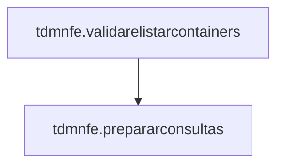

# uDmNFe

> Arquivo: `uDmNFe.pas`

## Visão geral

Este *DataModule* centraliza **conexão com o banco (FireDAC/SQL Server)**, **consultas (cabecalho/detalhe/contêiner)** e a **configuração do ACBrNFe**. Ele fornece métodos para preparar os datasets para um determinado `NR_PROCESSO` e também utilitários para validar/listar contêineres e montar a pasta de saída.

## Dependências

### Uses (interface)

- `System.SysUtils`
- `System.Classes`
- `System.IOUtils`
- `Data.DB`
- `FireDAC.Comp.Client`
- `FireDAC.Stan.Intf`
- `FireDAC.Stan.Param`
- `FireDAC.Comp.DataSet`
- `FireDAC.Phys.Intf`
- `FireDAC.Phys`
- `FireDAC.Phys.MSSQL`
- `FireDAC.Phys.MSSQLDef`
- `ACBrNFe`
- `ACBrDFeSSL`
- `FireDAC.Stan.Option`
- `FireDAC.Stan.Error`
- `FireDAC.UI.Intf`
- `FireDAC.Stan.Def`
- `FireDAC.Stan.Pool`
- `FireDAC.Stan.Async`
- `FireDAC.VCLUI.Wait`
- `FireDAC.DatS`
- `FireDAC.DApt.Intf`
- `FireDAC.DApt`

## API (métodos implementados)

### TdmNFe.ConfigurarConexao

- **Assinatura:** `procedure TdmNFe.ConfigurarConexao;`

- **Linha (aprox.):** 53

- **O que faz:** Configura dependências/infraestrutura necessárias antes de executar o fluxo principal.

- **Passos-chave (pelo código):**
  - Garante conexão FireDAC aberta.

### TdmNFe.ConfigurarACBr

- **Assinatura:** `procedure TdmNFe.ConfigurarACBr;`

- **Linha (aprox.):** 59

- **O que faz:** Configura dependências/infraestrutura necessárias antes de executar o fluxo principal.

- **Passos-chave (pelo código):**
  - Interage com o componente ACBrNFe para montar/gravar XML.
  - Cria diretórios necessários em disco.
  - Abre a consulta para leitura dos dados.

### TdmNFe.ConfigurarSQLCab

- **Assinatura:** `procedure TdmNFe.ConfigurarSQLCab;`

- **Linha (aprox.):** 77

- **O que faz:** Configura dependências/infraestrutura necessárias antes de executar o fluxo principal.

### TdmNFe.ConfigurarSQLDet

- **Assinatura:** `procedure TdmNFe.ConfigurarSQLDet;`

- **Linha (aprox.):** 118

- **O que faz:** Configura dependências/infraestrutura necessárias antes de executar o fluxo principal.

### TdmNFe.ConfigurarSQLCntr

- **Assinatura:** `procedure TdmNFe.ConfigurarSQLCntr;`

- **Linha (aprox.):** 213

- **O que faz:** Configura dependências/infraestrutura necessárias antes de executar o fluxo principal.

### TdmNFe.DataModuleCreate

- **Assinatura:** `procedure TdmNFe.DataModuleCreate(Sender: TObject);`

- **Linha (aprox.):** 222

- **O que faz:** Evento de UI/ciclo de vida que inicializa e dispara o fluxo.

- **Passos-chave (pelo código):**
  - Interage com o componente ACBrNFe para montar/gravar XML.

### TdmNFe.PrepararConsultas

- **Assinatura:** `procedure TdmNFe.PrepararConsultas(const ANrProcesso: string);`

- **Linha (aprox.):** 232

- **O que faz:** Executa uma etapa do fluxo do sistema.

- **Passos-chave (pelo código):**
  - Configura parâmetros SQL.

- **É chamado por:**
  - `tdmnfe.validarelistarcontainers`
  - `tnfeservice.gerarnfe`

### TdmNFe.PrepararConsultaDet

- **Assinatura:** `procedure TdmNFe.PrepararConsultaDet(const ANrProcesso: string; const ANrAdicao: Integer; const ANrCntr: string);`

- **Linha (aprox.):** 244

- **O que faz:** Executa uma etapa do fluxo do sistema.

- **Passos-chave (pelo código):**
  - Configura parâmetros SQL.

### TdmNFe.ObterPastaProcesso

- **Assinatura:** `function TdmNFe.ObterPastaProcesso(const ANrProcesso: string): string;`

- **Linha (aprox.):** 252

- **O que faz:** Calcula caminhos e nomes de arquivos/pastas onde os XMLs serão gravados.

- **Passos-chave (pelo código):**
  - Interage com o componente ACBrNFe para montar/gravar XML.
  - Cria diretórios necessários em disco.

### TdmNFe.ValidarEListarContainers

- **Assinatura:** `function TdmNFe.ValidarEListarContainers(const ANrProcesso: string): TStringList; var   S: string;`

- **Linha (aprox.):** 260

- **O que faz:** Valida pré-requisitos do processo e interrompe o fluxo caso algo obrigatório esteja ausente.

- **Passos-chave (pelo código):**
  - Abre a consulta para leitura dos dados.
  - Posiciona no primeiro registro do dataset.
  - Avança o cursor do dataset.
  - Controla loop até o fim do dataset.

- **Chama:**
  - `tdmnfe.prepararconsultas`

## Grafo de chamadas (unit)

