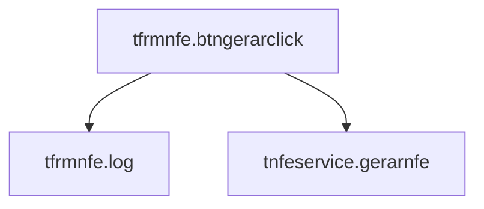

# uFrmNFe

> Arquivo: `uFrmNFe.pas`

## Visão geral

Esta unit contém o formulário principal (`TfrmNfe`). Ele recebe o `NR_PROCESSO`, dispara a geração e exibe logs/resultado para o usuário.

## Dependências

### Uses (interface)

- `Winapi.Windows`
- `Winapi.Messages`
- `System.SysUtils`
- `System.Classes`
- `Vcl.Graphics`
- `Vcl.Controls`
- `Vcl.Forms`
- `Vcl.Dialogs`
- `Vcl.StdCtrls`
- `uDmNFe`
- `uNFeService`

## API (métodos implementados)

### TfrmNFe.FormShow

- **Assinatura:** `procedure TfrmNFe.FormShow(Sender: TObject);`

- **Linha (aprox.):** 38

- **O que faz:** Evento de UI/ciclo de vida que inicializa e dispara o fluxo.

### TfrmNFe.Log

- **Assinatura:** `procedure TfrmNFe.Log(const S: string);`

- **Linha (aprox.):** 43

- **O que faz:** Registra mensagens de andamento/resultado para o usuário.

- **É chamado por:**
  - `tfrmnfe.btngerarclick`

### TfrmNFe.btnGerarClick

- **Assinatura:** `procedure TfrmNFe.btnGerarClick(Sender: TObject); var   Service: TNFeService;   Lista: TStringList;   i: Integer;   NrProcesso: string;`

- **Linha (aprox.):** 48

- **O que faz:** Evento de UI/ciclo de vida que inicializa e dispara o fluxo.

- **Chama:**
  - `tfrmnfe.log`
  - `tnfeservice.gerarnfe`

## Grafo de chamadas (unit)

