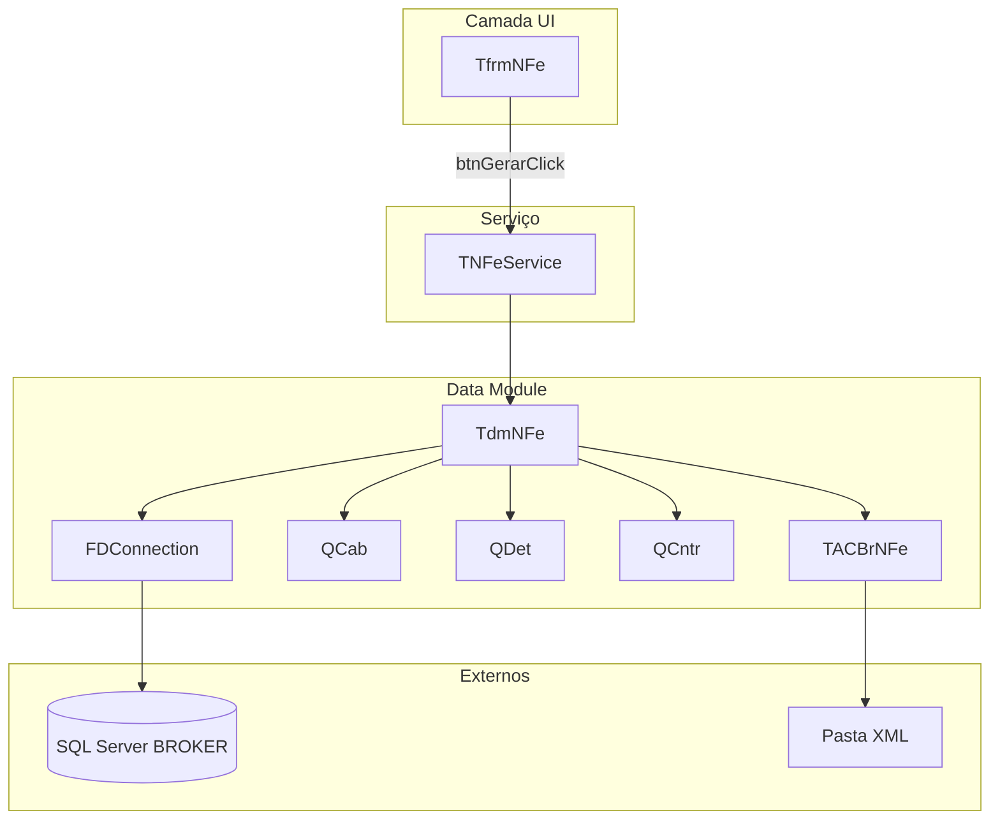
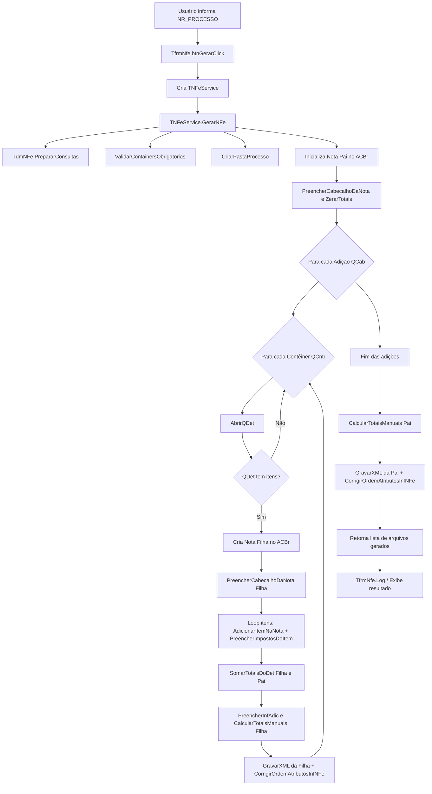

# CriaXmlNfe

Documentação de início para alterações no projeto de geração de XML de NF-e a partir de processos de importação.

---

## Visão geral

| Aspecto | Descrição |
|---------|-----------|
| **Tipo** | Aplicação Delphi VCL (Windows) |
| **Propósito** | Gerar XMLs de NF-e a partir de dados do banco SQL Server (BROKER) para processos de importação (marítimos e aéreos) |
| **Versão Delphi** | 10.2 Tokyo (ProjectVersion 18.4) |
| **Tecnologias** | FireDAC, ACBr NFe, SQL Server |

---

## Estrutura de arquivos

| Componente | Arquivo | Responsabilidade |
|------------|---------|------------------|
| Entrada | `CriaXmlNfe.dpr` | Programa principal |
| Form principal | `uFrmNFe.pas` / `uFrmNFe.dfm` | UI: entrada do NR_PROCESSO, botão Gerar, log |
| DataModule | `uDmNFe.pas` / `uDmNFe.dfm` | Conexão DB, consultas (QCab, QDet, QCntr), configuração ACBr |
| Serviço | `uNFeService.pas` | Orquestração, montagem nota pai/filhas, gravação XML |

---

## Arquitetura – Componentes e dependências



**Versão textual do diagrama** (visível sem renderização Mermaid):

```
[Arquitetura - Fluxo de Componentes]
┌─────────────────┐
│  TfrmNFe (UI)   │
└────────┬────────┘
         │ btnGerarClick
         ▼
┌─────────────────┐     ┌──────────────────────────────────┐
│  TNFeService    │────▶│  TdmNFe (Data Module)             │
│  (Serviço)      │     │  - FDConnection → SQL Server      │
└─────────────────┘     │  - QCab, QDet, QCntr             │
                        │  - TACBrNFe → Pasta XML           │
                        └──────────────────────────────────┘
```

---

## Fluxo principal de geração



**Versão textual do diagrama** (visível sem renderização Mermaid):

```
[Fluxo Principal]
1. Usuário informa NR_PROCESSO
2. btnGerarClick → TNFeService.Create → GerarNFe
3. PrepararConsultas, ValidarContainers, CriarPastaProcesso
4. Inicializa Nota Pai (ACBr)
5. Para cada Adição (QCab):
   - Para cada Contêiner (QCntr):
     - AbrirQDet
     - Se tem itens: Cria Nota Filha, preenche itens, calcula totais, GravarXML
6. Fim adições: CalcularTotaisManuais Pai, GravarXML Pai
7. Retorna lista de XMLs, exibe no Log
```

---

## Modos de operação

1. **Modo aéreo (IA):** gera apenas nota MÃE (sem containers).
2. **Modo marítimo (IM):**
   - 1 container: apenas nota MÃE.
   - 2+ containers: nota MÃE + notas FILHAS (uma por adição/container).

---

## Dependências técnicas

- **FireDAC** – acesso ao SQL Server
- **ACBr NFe** – montagem e serialização do XML (versão ≈ 2020)
- **SQL Server** – schema BROKER com tabelas TPROCESSO, TADICAO_DE_IMPORTACAO, TDETALHE_MERCADORIA etc.

---

## Configurações sensíveis

- **Conexão DB:** credenciais em `uDmNFe.dfm` (FDConnection1)
- **Path XML:** fixo em `ConfigurarACBr`: `C:\NFe\XML`
- **Consultas SQL:** dependência do schema `BROKER.DBO`

---

## Regras de integração (não opcionais)

Documentadas em `Context_AI/changelog.md`. Resumo:

1. **Tag `<IPI>` sempre gerada** – mesmo sem cobrança (CST 99, valores zerados). A central rejeita XML sem `<IPI>`.
2. **Ordem da tag `<infNFe>`** – a central exige `Id` antes de `versao`. Pós-processamento via `CorrigirOrdemAtributosInfNFeNoArquivo`.
3. **ACBr ≈ 2020** – versão validada. Atualizações podem quebrar essas regras.

### Detalhe – Tag infNFe

O ACBr antigo serializa: `<infNFe versao="4.00" Id="NFe...">`  
A central exige: `<infNFe Id="NFe..." versao="4.00">`  
Solução: helper `CorrigirOrdemAtributosInfNFeNoArquivo` ajusta após cada `GravarXML`.

---

## Pontos de melhoria

- Externalizar configuração de conexão e path XML
- Tratamento de erros mais robusto
- Atualização futura do ACBr com suporte nativo a IBSCBS/IBSCBSTot

---

## Checklist antes de alterar

- [ ] Validar impactos na integração com a central
- [ ] Verificar compatibilidade com a versão do ACBr
- [ ] Testar em homologação antes de produção
- [ ] Consultar `Context_AI/changelog.md` para regras existentes

---

## Referências

- `Context_AI/README.md` – visão geral e fluxo detalhado
- `Context_AI/changelog.md` – decisões técnicas e regras de integração (IPI, infNFe, versão ACBr)
- `Context_AI/uFrmNFe.md` – documentação da UI
- `Context_AI/uDmNFe.md` – documentação do DataModule
- `Context_AI/uNFeService.md` – documentação do serviço e regras de IPI
- `plan.md` – plano de inclusão de IBSCBS/IBSCBSTot via pós-processamento
