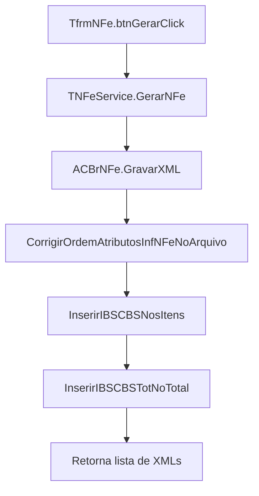

# Plano: Incluir IBSCBS e IBSCBSTot por pós-processamento

## Objetivo

Incluir no XML de NF-e gerado pelo projeto os grupos **`<IBSCBS>`** (por item) e **`<IBSCBSTot>`** (totalizador), **sem depender da versão atual do ACBr**, via **pós-processamento do XML gravado em disco**, e preparar o `SELECT` com campos fictícios que depois serão substituídos pelos valores reais pela equipe de banco de dados.

---

## Visão geral da abordagem

- **Camada de cálculo:** não será alterada no ACBr/pcnNFe; vamos apenas **reabrir e editar o XML** depois de `GravarXML`.
- **Dados de IBS/CBS:** por enquanto virão de **campos fictícios** adicionados ao `SELECT` de detalhes em `uDmNFe.pas` (procedure `ConfigurarSQLDet`).
- **Pontos de injeção no XML:**
  - `<det><imposto>...</imposto>` → inserir um bloco `<IBSCBS>...</IBSCBS>` por item.
  - `<total>...</total>` → inserir um bloco `<IBSCBSTot>...</IBSCBSTot>` logo após `<ICMSTot>` e antes de `<vNFTot>`.
- **Reutilizar padrão atual:** seguir a mesma estratégia da função `CorrigirOrdemAtributosInfNFeNoArquivo` em `uNFeService.pas`, trabalhando com string/texto do XML.

---

## Passo 1 – Estender o SELECT de detalhes com campos fictícios

No método `TdmNFe.ConfigurarSQLDet` em `uDmNFe.pas`, após os campos já existentes para imposto (PIS/COFINS etc.), incluir **aliases fictícios** para IBS/CBS por item e totais. Exemplo de novos campos (valores de teste, serão trocados pelo responsável do banco):

- **Por item (para `<IBSCBS>`):**
  - `IBS_CST` (ex.: `'000'`)
  - `IBS_cClassTrib` (ex.: `'000001'`)
  - `IBS_vBC` (ex.: `CONVERT(DECIMAL(28,2), DM.VL_BASE_CALC_II)` ou valor fixo)
  - `IBS_pIBSUF`, `IBS_vIBSUF`
  - `IBS_pIBSMun`, `IBS_vIBSMun`
  - `IBS_vIBS`
  - `IBS_pCBS`, `IBS_vCBS`

- **Totais (para `<IBSCBSTot>`):**
  - `IBSTOT_vBCIBSCBS`
  - `IBSTOT_vIBSUF`, `IBSTOT_vIBSMun`, `IBSTOT_vIBS`, `IBSTOT_vCBS`
  - `IBSTOT_vDif_UF`, `IBSTOT_vDevTrib_UF`, `IBSTOT_vCredPres_UF`, `IBSTOT_vCredPresCondSus_UF`
  - `IBSTOT_vDif_CBS`, `IBSTOT_vDevTrib_CBS`, `IBSTOT_vCredPres_CBS`, `IBSTOT_vCredPresCondSus_CBS`

Esses campos devem ser definidos no `SELECT` com **valores constantes ou fórmulas simples**, apenas para testes, até que o DBA substitua por referências corretas a tabelas/colunas.

> Observação: não é necessário usar esses campos nos objetos Delphi (TNFe, TDetCollectionItem), pois o uso será apenas no pós-processamento do XML.

---

## Passo 2 – Criar helpers de pós-processamento do XML em uNFeService

Em `uNFeService.pas`, criar duas novas rotinas privadas:

### 2.1 `procedure InserirIBSCBSNosItens(const ANomeArquivoXML: string);`

- Ler o XML como texto (UTF-8), semelhante a `CorrigirOrdemAtributosInfNFeNoArquivo`.
- Para cada `<det nItem="X">`:
  - Localizar o bloco `<imposto> ... </imposto>`.
  - Após o fechamento de `</COFINS>` (ou antes de `</imposto>` se não houver COFINS), inserir um trecho `IBSCBS` com base no layout do exemplo:

```xml
<IBSCBS>
  <CST>000</CST>
  <cClassTrib>000001</cClassTrib>
  <gIBSCBS>
    <vBC>172032.89</vBC>
    <gIBSUF>
      <pIBSUF>0.1000</pIBSUF>
      <vIBSUF>172.03</vIBSUF>
    </gIBSUF>
    <gIBSMun>
      <pIBSMun>0.0000</pIBSMun>
      <vIBSMun>0.00</vIBSMun>
    </gIBSMun>
    <vIBS>172.03</vIBS>
    <gCBS>
      <pCBS>0.9000</pCBS>
      <vCBS>1548.30</vCBS>
    </gCBS>
  </gIBSCBS>
</IBSCBS>
```

- Nesta primeira fase, os valores podem ser **constantes** (espelhando o exemplo) ou, numa evolução futura, podem ser lidos via cursor/loop do dataset `QDet` antes de gravar o XML (armazenando em uma estrutura auxiliar para o pós-processamento).

### 2.2 `procedure InserirIBSCBSTotNoTotal(const ANomeArquivoXML: string);`

- Ler o XML como texto.
- Dentro de `<total>`, localizar o bloco `<ICMSTot>...</ICMSTot>`.
- Logo após `</ICMSTot>` e antes de `<vNFTot>`, inserir o bloco `<IBSCBSTot>...</IBSCBSTot>` com o layout do exemplo:

```xml
<IBSCBSTot>
  <vBCIBSCBS>172032.89</vBCIBSCBS>
  <gIBS>
    <gIBSUF>
      <vDif>0.00</vDif>
      <vDevTrib>0.00</vDevTrib>
      <vIBSUF>172.03</vIBSUF>
    </gIBSUF>
    <gIBSMun>
      <vDif>0.00</vDif>
      <vDevTrib>0.00</vDevTrib>
      <vIBSMun>0.00</vIBSMun>
    </gIBSMun>
    <vIBS>172.03</vIBS>
    <vCredPres>0.00</vCredPres>
    <vCredPresCondSus>0.00</vCredPresCondSus>
  </gIBS>
  <gCBS>
    <vDif>0.00</vDif>
    <vDevTrib>0.00</vDevTrib>
    <vCBS>1548.30</vCBS>
    <vCredPres>0.00</vCredPres>
    <vCredPresCondSus>0.00</vCredPresCondSus>
  </gCBS>
</IBSCBSTot>
```

- Inicialmente os valores podem ser **fixos** ou **baseados em um único registro de teste**, só para validar a estrutura junto à SEFAZ/central.

---

## Passo 3 – Integrar helpers ao fluxo de geração de XML

Ainda em `uNFeService.pas`, no método `TNFeService.GerarNFe`:

1. **Para cada nota filha:**
   - Após `GravarXML(NomeXMLFilha);`
   - E após `CorrigirOrdemAtributosInfNFeNoArquivo(NomeXMLFilha);`
   - Chamar, na sequência:
     - `InserirIBSCBSNosItens(NomeXMLFilha);`
     - `InserirIBSCBSTotNoTotal(NomeXMLFilha);`

2. **Para a nota mãe:**
   - Após `GravarXML(NomeXMLMae);`
   - E após `CorrigirOrdemAtributosInfNFeNoArquivo(NomeXMLMae);`
   - Chamar as mesmas rotinas.

Dessa forma, **todas as notas geradas** (mãe e filhas) terão os grupos `IBSCBS` e `IBSCBSTot` injetados, sem modificar o componente ACBr.

---

## Passo 4 – Preparar para a futura atualização do ACBr

Quando o ACBr for atualizado para uma versão que tenha suporte nativo a IBS/CBS:

1. **Remover o pós-processamento:**
   - Eliminar as chamadas a `InserirIBSCBSNosItens` e `InserirIBSCBSTotNoTotal` de `GerarNFe`.
   - Remover (ou desativar) as próprias rotinas helper.

2. **Ligar os campos do SELECT aos objetos ACBr:**
   - Em vez de usar pós-processamento, mapear os novos campos do `SELECT` (`IBS_*`, `IBSTOT_*`) para as propriedades correspondentes no objeto `TNFe`/`DetItem` conforme a API da nova versão do ACBr.

3. **Revisar o changelog:**
   - Atualizar `Context_AI/changelog.md` documentando que a responsabilidade pelos grupos IBS/CBS foi transferida do pós-processamento para o ACBr.

---

## Diagrama de fluxo com pós-processamento



**Versão textual do diagrama** (visível sem renderização Mermaid):

```
[Fluxo de Pós-processamento IBSCBS/IBSCBSTot]
1. TfrmNFe.btnGerarClick
2. → TNFeService.GerarNFe
3. → ACBrNFe.GravarXML (gera XML inicial)
4. → CorrigirOrdemAtributosInfNFeNoArquivo (ajusta tag infNFe)
5. → InserirIBSCBSNosItens (injeta IBSCBS em cada <det><imposto>)
6. → InserirIBSCBSTotNoTotal (injeta IBSCBSTot em <total>)
7. → Retorna lista de arquivos XML gerados
```

---

## INCLUSÃO DO IBSCBS

### Campos do SELECT (uDmNFe.pas – ConfigurarSQLDet)

Mapeamento dos aliases usados no código para os nomes originais da especificação XML. O nome original aparece em comentário ao final de cada linha para facilitar busca e leitura.

| Alias no código | Coluna/tabela | Nome original (comentário) |
|-----------------|---------------|----------------------------|
| `IBS_CST` | CASE por CD_GRUPO/CD_CFOP | [\<IBSCBS\> - \<CST\>] |
| `IBS_cClassTrib` | CASE por CD_GRUPO/CD_CFOP | [\<IBSCBS\> - \<cClassTrib\>] |
| `IBS_vBC` | DM.VL_BASE_IBS_CBS | [\<IBSCBS\> - \<gIBSCBS\> - \<vBC\>] |
| `IBS_pIBSUF` | AI.ALIQ_IBS_UF | [\<IBSCBS\> - \<gIBSCBS\> - \<gIBSUF\> - \<pIBSUF\>] |
| `IBS_vIBSUF` | DM.VL_IBS_UF | [\<IBSCBS\> - \<gIBSCBS\> - \<gIBSUF\> - \<vIBSUF\>] |
| `IBS_pIBSMun` | AI.ALIQ_IBS_MUN | [\<IBSCBS\> - \<gIBSCBS\> - \<gIBSMun\> - \<pIBSMun\>] |
| `IBS_vIBSMun` | DM.VL_IBS_MUN | [\<IBSCBS\> - \<gIBSCBS\> - \<gIBSMun\> - \<vIBSMun\>] |
| `IBS_vIBS` | VL_IBS_UF + VL_IBS_MUN | [\<IBSCBS\> - \<gIBSCBS\> - \<vIBS\>] |
| `IBS_pCBS` | AI.ALIQ_CBS | [\<IBSCBS\> - \<gIBSCBS\> - \<gCBS\> - \<pCBS\>] |
| `IBS_vCBS` | DM.VL_CBS | [\<IBSCBS\> - \<gIBSCBS\> - \<gCBS\> - \<vCBS\>] |

### Regras de CST e cClassTrib (CASE)

**IBS_CST** – valores por CFOP (CD_GRUPO = 'D22'):

- 3101, 3551, 3556, 3949 (CD_COBERT_CAMBIAL = '4') → '000'
- 3127, 3930 → '550'
- 3949 (demais) → '410'
- ELSE → '000'

**IBS_cClassTrib** – valores por CFOP:

- 3101, 3551, 3556, 3949 (CD_COBERT_CAMBIAL = '4') → '000001'
- 3127 → '550007'
- 3930 → '550006'
- 3949 (demais) → '410999'
- ELSE → '000001'

### Tabelas e colunas utilizadas

- **DM** (TDETALHE_MERCADORIA): VL_BASE_IBS_CBS, VL_IBS_UF, VL_IBS_MUN, VL_CBS
- **AI** (TADICAO_DE_IMPORTACAO): ALIQ_IBS_UF, ALIQ_IBS_MUN, ALIQ_CBS

### Observação

O pós-processamento atual (`InserirIBSCBSNosItens`, `InserirIBSCBSTotNoTotal`) ainda utiliza valores fixos. O SELECT está pronto para uso quando o pós-processamento for alterado para ler do dataset (ou quando o ACBr for atualizado com suporte nativo a IBSCBS).

---

## IBSCBS com dados reais (evolução do plano)

# Plano: Usar campos IBS_* do banco para gerar IBSCBS/IBSCBSTot

## Objetivo

Parar de usar os helpers genéricos `InserirIBSCBSNosItens` e `InserirIBSCBSTotNoTotal` com valores fixos e passar a *calcular e montar as tags `<IBSCBS>` e `<IBSCBSTot>` usando os campos IBS_ vindos do banco**, ainda via inserção textual no XML já gravado pelo ACBr.

---

## 1. Remover/neutralizar pós-processamento fixo

Arquivos envolvidos:

- `uNFeService.pas`

Passos:

1. Remover (ou comentar) as chamadas a:
   - `InserirIBSCBSNosItens(NomeXMLFilha)` / `InserirIBSCBSTotNoTotal(NomeXMLFilha)`
   - `InserirIBSCBSNosItens(NomeXMLMae)` / `InserirIBSCBSTotNoTotal(NomeXMLMae)`
   em todos os pontos de `GerarNFe` (modo aéreo e marítimo).
2. Opcionalmente, manter as procedures `InserirIBSCBSNosItens` / `InserirIBSCBSTotNoTotal` apenas como referência histórica, ou removê-las de vez quando a nova abordagem estiver estável.

---

## 2. Preparar leitura dos campos IBS_* por item

Arquivo:

- `uDmNFe.pas` – `ConfigurarSQLDet`

Aliases já existentes:

- `IBS_CST`, `IBS_cClassTrib`, `IBS_vBC`, `IBS_pIBSUF`, `IBS_vIBSUF`, `IBS_pIBSMun`, `IBS_vIBSMun`, `IBS_vIBS`, `IBS_pCBS`, `IBS_vCBS`

Plano de uso em `uNFeService.pas`:

1. Definir tipos auxiliares:

   - `TIBSCBSInfo = record nItem: Integer; CST, cClassTrib: string; vBC, pIBSUF, vIBSUF, pIBSMun, vIBSMun, vIBS, pCBS, vCBS: Double; end;`
   - `TIBSCBSTotais = record vBCIBSCBS, vIBSUF, vIBSMun, vIBS, vCBS: Double; end;`

2. Manter arrays/listas em memória por nota:

   - Para nota mãe: `FIBSItensMae`, `FIBSTotaisMae`
   - Para notas filhas: `FIBSItensFilha`, `FIBSTotaisFilha`

3. Durante o loop que percorre `QDet` e chama `AdicionarItemNaNota`, popular essas estruturas com os valores IBS_* para cada item (`QDet.FieldByName('IBS_*')`).

4. Garantir alinhamento entre `det nItem` no XML e a posição na lista (usar `DetItem.Prod.nItem` como chave).

---

## 3. Montar as tags IBSCBS por item usando os dados da lista

Nova estratégia para substituir o pós-processamento fixo:

1. Criar um método privado em `TNFeService`:

   - `procedure TNFeService.InserirIBSCBSNosItensComDados(const ANomeArquivoXML: string; const AIBSInfo: array of TIBSCBSInfo; ACount: Integer);`

2. Implementação geral:

   - Ler o XML: `S := TFile.ReadAllText(ANomeArquivoXML, TEncoding.UTF8);`
   - Para cada item IBS em `AIBSInfo` (em ordem de `nItem`):
     1. Localizar o `<det nItem="X">` correspondente.
     2. Dentro desse `<det>`, localizar o fechamento de `</COFINS>` (ou `</imposto>` se não houver COFINS).
     3. Construir a string `<IBSCBS>...</IBSCBS>` usando `Format`/`FloatToStrF` com os valores de `TIBSCBSInfo`, garantindo ponto decimal e casas adequadas.
     4. Inserir essa string imediatamente após `</COFINS>`.
   - Gravar o XML novamente.

3. Cuidados:

   - Usar formatação numérica compatível com XML da NF-e (ponto decimal, casas decimais corretas).
   - Tratar casos de item sem IBS (se algum campo vier `NULL`, decidir se gera zero ou pula o `IBSCBS`).

---

## 4. Calcular e montar IBSCBSTot a partir dos itens

Ainda em `uNFeService.pas`:

1. Durante o preenchimento dos itens (quando preencher `FIBSItensMae`/`FIBSItensFilha`):

   - Acumular totais em `FIBSTotaisMae`/`FIBSTotaisFilha`:
     - `vBCIBSCBS` = soma de `IBS_vBC` dos itens
     - `vIBSUF`    = soma de `IBS_vIBSUF`
     - `vIBSMun`   = soma de `IBS_vIBSMun`
     - `vIBS`      = soma de `IBS_vIBS`
     - `vCBS`      = soma de `IBS_vCBS`
     - Demais campos (`vDif`, `vDevTrib`, `vCredPres`, `vCredPresCondSus`) iniciam em 0 na primeira versão.

2. Após a geração da nota (filha ou mãe) e a gravação do XML pelo ACBr:

   - Criar um método privado:
     - `procedure TNFeService.InserirIBSCBSTotComDados(const ANomeArquivoXML: string; const ATotais: TIBSCBSTotais);`
   - Implementação:
     - Ler o XML em string.
     - Localizar `</ICMSTot>` dentro de `<total>`.
     - Construir o bloco `<IBSCBSTot>...</IBSCBSTot>` usando `ATotais`.
     - Inserir esse bloco logo após `</ICMSTot>` (antes de `<vNFTot>`).

---

## 5. Integração no fluxo GerarNFe (mãe e filhas)

No método `TNFeService.GerarNFe`:

1. Para cada nota FILHA:

   - Antes de `GravarXML(NomeXMLFilha)`, garantir que `FIBSItensFilha` e `FIBSTotaisFilha` estão completos.
   - Após `CorrigirOrdemAtributosInfNFeNoArquivo(NomeXMLFilha);`
     - Chamar `InserirIBSCBSNosItensComDados(NomeXMLFilha, FIBSItensFilha, FIBSCountFilha);`
     - Chamar `InserirIBSCBSTotComDados(NomeXMLFilha, FIBSTotaisFilha);`

2. Para a nota MÃE:

   - Manter `FIBSItensMae` e `FIBSTotaisMae`, alimentados quando os itens são replicados na nota mãe.
   - Após `CorrigirOrdemAtributosInfNFeNoArquivo(NomeXMLMae);`
     - Chamar `InserirIBSCBSNosItensComDados(NomeXMLMae, FIBSItensMae, FIBSCountMae);`
     - Chamar `InserirIBSCBSTotComDados(NomeXMLMae, FIBSTotaisMae);`

Dessa forma, tanto mãe quanto filhas terão IBSCBS/IBSCBSTot com valores vindos diretamente do banco.

---

## 6. Atualização da documentação

- Atualizar este `plan.md` (seção **INCLUSÃO DO IBSCBS**) para indicar que:
  - O SELECT de `uDmNFe.pas` é a fonte oficial de dados IBS/CBS.
  - Os helpers de pós-processamento fixo foram substituídos por versões que consomem `IBS_*` dos datasets.
  - Há tipos auxiliares (`TIBSCBSInfo`, `TIBSCBSTotais`) responsáveis por carregar/totalizar esses dados.

---

## Resumo

- **Antes:** pós-processamento fixo, sem usar dados reais do banco.
- **Depois:** os campos IBS_* retornados pelo SELECT em `uDmNFe.pas` alimentam estruturas em memória em `uNFeService.pas`, e as tags `<IBSCBS>` e `<IBSCBSTot>` são montadas dinamicamente e inseridas no XML final, mantendo a independência da versão atual do ACBr e permitindo evolução futura para suporte nativo.
