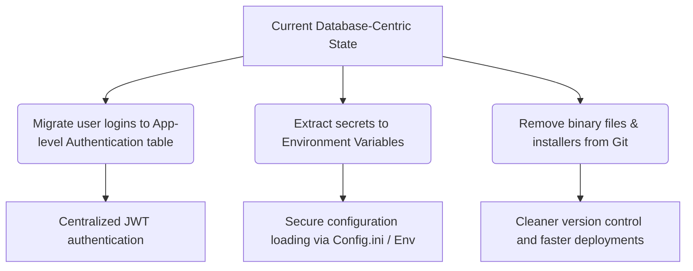

## 3. Recommended Actions & Next Steps

Based on the findings, the following architectural and security improvements are highly recommended:

### Next Steps for Implementation:
1.  **Configuration Decoupling**: Extract hardcoded credentials (including SQL sa, Senior ERP `UserWS`, and API keys) and paths into external configuration files (`Config.ini`) or OS Environment Variables.
2.  **Authentication Modernization**: Migrate from database-level authentication (native SQL logins) to application-level user authentication. Store hashed passwords in a secure database table (`TUSUARIO`) and issue stateless JWT tokens.
3.  **Clean up Git Repository**: Run a Git purge to permanently remove large installers (`ER_Studio_8.0.3.rar`) and compiled DLL files from the repository history to reduce clone sizes and improve security.

---

