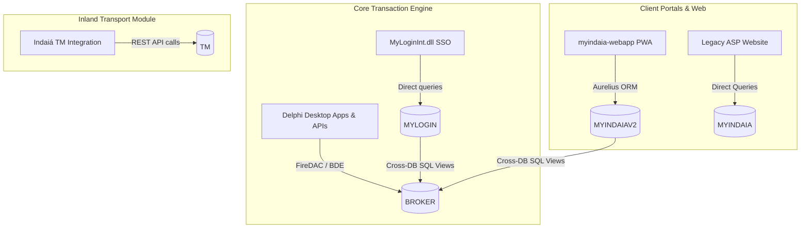

## 6. Database Topology & Server-Side Logic Audit

To complement the codebase audit, a comprehensive scan was performed on the database metadata files in `myindaia-database/csv`. The platform operates on a single SQL Server instance across **9 distinct database schemas** (excluding system catalogs).

### 6.1 Database Schema Mapping & Scale

| Schema Name | Role | Tables | Foreign Keys | Procedures | Triggers | Views |
|---|---|:---:|:---:|:---:|:---:|:---:|
| **`BROKER`** | Core logistics transaction engine (customs, follow-ups, parameters) | 1,204 | 187 | 2,419 | 69 | 69 |
| **`MYLOGIN`** | Central credentials manager & System Access Control List (ACL) | 7 | 5 | 9 | 1 | 2 |
| **`MYINDAIAV2`** | Modern customer portal PWA backend (TMS Aurelius ORM) | 69 | 30 | 10 | 0 | 2 |
| **`TM`** | Transport Management (inland shipping planilhas, dispatchers) | 33 | 20 | 10 | 0 | 1 |
| **`MYINDAIA`** | Legacy Classic ASP customer portal | 216 | 0 | 172 | 4 | 2 |
| **`DBA`** | Server administrative auditing (hosts Brent Ozar monitoring tools) | 1 | 0 | 3 | 0 | 0 |
| **`DATA-TEMP`** | Temporary database workspace (hosts sysdiagrams) | 1 | 0 | 8 | 0 | 0 |

---

### 6.2 Key Architectural Interconnections

#### A. MYINDAIAV2 and BROKER Integration
The modern customer portal database (`MYINDAIAV2`) stores modern entity structures (like `AuthUser`, `Beneficiary`, `Billing`, `CashRequested`, and `Customer`) in English tables mapped directly by TMS Aurelius. However, it does not duplicate shipping transaction data. Instead, it reads this data in real-time from the legacy `BROKER` database using cross-database SQL Views:
- **`vw_Processo_Resumo`**: Joins `MYINDAIAV2..CUSTOMCLEARANCE` with the legacy core tables `BROKER..TPROCESSO` and `BROKER..TFOLLOWUP` to aggregate process milestone dates (Abertura event `003`, Desembaraço event `088`, Saída event `132`, and Chegada event `162`).
- Other views (such as `Estufagem`, `LocalEmbarque`, `vw_Event`, `vw_Representante`, and `vw_ViaTransporte`) point directly to their legacy `BROKER` equivalents (e.g. `BROKER..TTP_ESTUFAGEM`, `BROKER..TLOCAL_EMBARQUE`, `BROKER..TEvento`, and `BROKER..TEMPRESA_NAC`), serving as read-only lookups for the new customer portal.

#### B. MYLOGIN and BROKER Integration
The central SSO module (`MYLOGIN` database) stores permission mappings and system access controls in standard ACL tables:
- `TB_SISTEMA`, `TB_MODULO`, `TB_ROTINA`, `TB_CONTROLE_ACESSO`, `TB_CARGO_SISTEMA`.
It delegates user identity and role records to `BROKER`'s user definitions via:
- **`VW_USUARIO`**: A view mapping directly to `BROKER.DBO.TUSUARIO`.
- **`VW_CARGO`**: A view mapping directly to `BROKER.DBO.TCARGO`.
- **`TR_TB_USUARIO_SENHAS_I_A`**: A trigger that automatically updates the last password alteration date (`DT_ULT_ALT_SENHA`) in `BROKER.DBO.TUSUARIO` whenever a password changes in `TB_USUARIO_SENHAS`.

#### C. TM (Transport Module) Isolation
The inland transport database (`TM`) is decoupled at the database level.
- Stored procedure **`sp_atualiza_tabelas_broker`** contains commented-out legacy cross-database queries that once copied terminals, transport partners, and companies from `BROKER` tables (`BROKER..TARMAZEM`, `BROKER..TTRANSP_ROD`, `BROKER..TEMPRESA_NAC`).
- This code is disabled. The modern sync between `BROKER` and `TM` is handled entirely at the **application layer** via API endpoints (REST calls to `api.myindaia.com.br` in `myindaia-integracaoindaiatm`), preventing shared-database coupling.

---

### 6.3 Server-Side Automation: The TR_FOLLOWUP Trigger

A significant portion of Indaiá's logistics status calculations is compiled directly into the SQL Server database via the trigger **`TR_FOLLOWUP`** on the `TFOLLOWUP` table. It coordinates tracking rules automatically:

1. **Nestlé B2B Ingestion (`CD_GRUPO = '155'`)**:
   - When the Nestlé Delphi robot (`myindaia-myintegracaonestle`) updates shipping milestones in the database, `TR_FOLLOWUP` automatically handles the workflow:
     - **Milestone Chaining**: If event `132` (Departure) is updated, it automatically sets event `114` to the current date.
     - **Estimated Arrival (ETA) Calculation**: For maritime (`CD_MODAL = '01'`) or road (`CD_MODAL = '07'`) shipments, the trigger uses a custom function `dbo.FN_ADD_DIAS_UTEIS` to calculate the estimated arrival date based on the destination country (e.g. adding 1 business day for country `'097'`, 2 business days for others, 5 days for country `'187'`, etc.) and writes it to event `622` (Arrival).
2. **Croda B2B Ingestion (`CD_EMPRESA IN ('03185', '00500')`)**:
   - Updates to event `146` (Arrival at terminal) automatically calculate and update event `500` for Croda shipments.
3. **Trigger Bypass Safeguards**:
   - The trigger queries the administrative tracking table `TFOLLOWUP_IGNORE_TRIGGERS` using the database session ID (`@@SPID`). If a matching record is found, the trigger immediately exits. This allows Delphi batch scripts to disable trigger execution for high-speed batch modifications.

---

### 6.4 Diagnostic Database Data Exports & Workflow Dumps

In addition to the database metadata in `myindaia-database/csv`, the workspace contains two diagnostic data folders that are direct dumps/exports from the live `BROKER` SQL Server database:

#### A. [myindaia-problemas-csv](file:///Users/ricardo/Library/CloudStorage/GoogleDrive-rolfilho@gmail.com/My%20Drive/Cowork%20Projects/Career/Consulting%20Hub/Indai%C3%A1%20Log%C3%ADstica%20%E2%80%94%20Strategic%20Advisory/01_Research/Arquivos_Sistema_Expo/myindaia-problemas-csv)
This folder holds schema definitions, procedure lists, and table dumps utilized for analyzing data consistency issues ("problemas"):
- **[Problema_1.csv](file:///Users/ricardo/Library/CloudStorage/GoogleDrive-rolfilho@gmail.com/My%20Drive/Cowork%20Projects/Career/Consulting%20Hub/Indai%C3%A1%20Log%C3%ADstica%20%E2%80%94%20Strategic%20Advisory/01_Research/Arquivos_Sistema_Expo/myindaia-problemas-csv/Problema_1.csv)**: A complete schema dump containing the list of database tables, column names, data types, lengths, nullability, and primary key identities.
- **[Problema_2.csv](file:///Users/ricardo/Library/CloudStorage/GoogleDrive-rolfilho@gmail.com/My%20Drive/Cowork%20Projects/Career/Consulting%20Hub/Indai%C3%A1%20Log%C3%ADstica%20%E2%80%94%20Strategic%20Advisory/01_Research/Arquivos_Sistema_Expo/myindaia-problemas-csv/Problema_2.csv)**: A text-based source export of all SQL Server stored procedures (T-SQL code).
- **[Problema_3_tdeclaracao_importacao.csv](file:///Users/ricardo/Library/CloudStorage/GoogleDrive-rolfilho@gmail.com/My%20Drive/Cowork%20Projects/Career/Consulting%20Hub/Indai%C3%A1%20Log%C3%ADstica%20%E2%80%94%20Strategic%20Advisory/01_Research/Arquivos_Sistema_Expo/myindaia-problemas-csv/Problema_3_tdeclaracao_importacao.csv)**: Actual record exports of import declarations from the `TDECLARACAO_IMPORTACAO` table.
- **[Problema_3_tfollowup_etapa.csv](file:///Users/ricardo/Library/CloudStorage/GoogleDrive-rolfilho@gmail.com/My%20Drive/Cowork%20Projects/Career/Consulting%20Hub/Indai%C3%A1%20Log%C3%ADstica%20%E2%80%94%20Strategic%20Advisory/01_Research/Arquivos_Sistema_Expo/myindaia-problemas-csv/Problema_3_tfollowup_etapa.csv)**: Data records of workflow milestone stages from the `TFOLLOWUP_ETAPA` table.
- **[Problema_3_tprocesso.csv](file:///Users/ricardo/Library/CloudStorage/GoogleDrive-rolfilho@gmail.com/My%20Drive/Cowork%20Projects/Career/Consulting%20Hub/Indai%C3%A1%20Log%C3%ADstica%20%E2%80%94%20Strategic%20Advisory/01_Research/Arquivos_Sistema_Expo/myindaia-problemas-csv/Problema_3_tprocesso.csv)**: Actual data rows containing active import processes from the core `TPROCESSO` table.

#### B. [myindaia-prioridades-csv](file:///Users/ricardo/Library/CloudStorage/GoogleDrive-rolfilho@gmail.com/My%20Drive/Cowork%20Projects/Career/Consulting%20Hub/Indai%C3%A1%20Log%C3%ADstica%20%E2%80%94%20Strategic%20Advisory/01_Research/Arquivos_Sistema_Expo/myindaia-prioridades-csv)
This folder holds transactional data records of core client mappings, tracking events, and exports used to analyze process priorities:
- **[Prioridade_3_tcliente_servico.csv](file:///Users/ricardo/Library/CloudStorage/GoogleDrive-rolfilho@gmail.com/My%20Drive/Cowork%20Projects/Career/Consulting%20Hub/Indai%C3%A1%20Log%C3%ADstica%20%E2%80%94%20Strategic%20Advisory/01_Research/Arquivos_Sistema_Expo/myindaia-prioridades-csv/Prioridade_3_tcliente_servico.csv)**: Data mapping between logistics customers and active system services from the `TCLIENTE_SERVICO` table.
- **[Prioridade_3_tfollowup.csv](file:///Users/ricardo/Library/CloudStorage/GoogleDrive-rolfilho@gmail.com/My%20Drive/Cowork%20Projects/Career/Consulting%20Hub/Indai%C3%A1%20Log%C3%ADstica%20%E2%80%94%20Strategic%20Advisory/01_Research/Arquivos_Sistema_Expo/myindaia-prioridades-csv/Prioridade_3_tfollowup.csv)**: Records from the main event tracking history table `TFOLLOWUP` containing process event status logs.
- **[Prioridade_3_tprocesso_exp.csv](file:///Users/ricardo/Library/CloudStorage/GoogleDrive-rolfilho@gmail.com/My%20Drive/Cowork%20Projects/Career/Consulting%20Hub/Indai%C3%A1%20Log%C3%ADstica%20%E2%80%94%20Strategic%20Advisory/01_Research/Arquivos_Sistema_Expo/myindaia-prioridades-csv/Prioridade_3_tprocesso_exp.csv)**: Operational tracking records for export shipments from the `TPROCESSO_EXP` table.

---

