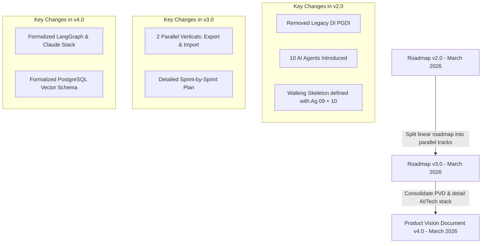

# Roadmap Analysis: Owner's Vision (v2–v4) vs. Technical Migration Plan

This document provides a comparative analysis of the **MyINDAIA** system migration plans. It evaluates the business roadmap designed by the owner of Indaiá, Fabricio (v2, v3, and v4 of the roadmap), and contrasts it with the technical discovery and target architecture plan documented in [migration_plan_discovery_target_architecture.md](file:///Users/ricardo/Library/CloudStorage/GoogleDrive-rolfilho@gmail.com/My%20Drive/Cowork%20Projects/Career/Consulting%20Hub/Indai%C3%A1%20Log%C3%ADstica%20%E2%80%94%20Strategic%20Advisory/01_Research/Arquivos_Sistema_Expo/Analyzes%20Ricardo%20Leite/migration_plan_discovery_target_architecture.md).

---

## 1. Executive Summary

The migration of the MyINDAIA platform has two competing planning sources:
1. **The Owner's Roadmap (v2–v4)**: Developed by Fabricio, a non-technical stakeholder with 26 years of operational context in Brazilian customs brokerage. This plan is highly business-driven, customer-centric, and focused on the rapid delivery of incremental value using Martin Fowler's software engineering principles.
2. **The Technical Migration Plan**: Developed by the engineering team. This plan focuses on deep codebase scanning, database trigger reverse engineering, infrastructure security, and decoupling dependencies.

**Core Finding**: While the technical plan excels at detailing system internals and identifying critical security and data hazards, the owner's plan provides the essential commercial context, strategic scope reductions, and operational milestones needed to make the project economically viable. A successful migration requires a hybrid approach that integrates the owner’s business scope with the engineering team's architectural safeguards.

---

## 2. Evolution of the Owner's Roadmap (v2 ➔ v3 ➔ v4)

Analyzing the changes across newer versions of the owner's roadmap reveals a clear strategic direction:

### Roadmap v2.0
* **DI Legada (PGDI) Elimination**: Removed the legacy Import Declaration (DI) module rewrite from the scope because operations have transitioned to the federal government's new **DUIMP** (Declaração Única de Importação) standard.
* **Walking Skeleton Expansion**: Added Agent 09 (Booking Marítimo) and Agent 10 (Gestão de Allocation/MQC) into the early "Walking Skeleton" phase to deliver immediate, visible value to users by automating container bookings and contract compliance tracking.

### Roadmap v3.0
* **Linear to Parallel Track Restructuring**: Split the single linear migration path into **two parallel operational verticals (Exportação and Importação)** supported by a shared Transversal layer. This allows two independent engineering teams to work concurrently after the initial shared foundation is established, accelerating time-to-market.
* **Detailed Sprints**: Mapped out Sprints 0 through 13 with specific client-facing deliverables for each milestone.

### Product Vision Document (PVD) v4.0 (Latest)
* **AI/Tech Stack Detailing**: Formalized the tech stack details, using **LangGraph** (leveraging Claude Sonnet 4) for orchestrating the 10 AI agents, rather than defining a specific agent framework like Agno (which is proposed in the technical plan).
* **Econonomical Quantification of Scope Reduction**: Quantified the savings of the **DUIMP-only** decision:
  * **Time saved**: ~36 weeks (9 months).
  * **Cost saved**: ~R$ 230,000 in direct dev costs.
  * **Risk mitigated**: Completely eliminated the critical fiscal risk of porting legacy database stored procedures (like `sp_di_calculo` and `sp_calc_*`) to Python, as DUIMP shifts calculation calculations to the Receita Federal's Portal Único.

---

## 3. Business Context and Desires Extraction

Fabricio’s roadmap is guided by a clear business vision: **transform Indaiá into Brazil's first AI-First customs broker**, where AI agents perform 80% of the manual operational tasks (data entry, document parsing, scheduling, tracking) and human analysts act as supervisors focusing on high-value client relations and complex exceptions.

### Core Business Pillars
* **Customer-Centric Value (Martin Fowler Philosophy)**:
  * *Evolutionary Architecture*: Rather than planning the ultimate microservices structure, build in small, reversible steps.
  * *Walking Skeleton*: Deliver an end-to-end slice in production by **Week 8** (e.g., automated arrival notifications to clients and automated container booking for analysts) so customers feel the value immediately.
  * *Strangler Fig Pattern*: Wrap legacy Delphi code with a Python FastAPI API Gateway (`ROUTING_TABLE`), gradually migrating traffic without taking the legacy system offline.
  * *Feature Toggles*: Roll out the new system client-by-client, starting with smaller, more tolerant accounts to validate stability before moving to large multinationals like BASF or Nestlé.
* **Data as a Competitive Advantage**: Use 26 years of historical operational records (NCM classifications, customer-specific follow-up codes, shipment logs) as few-shot training examples to maximize LLM accuracy.
* **Government Portal Integration & Human-in-the-Loop**: Establish a strict security rule: **No tax declaration (DUIMP, DU-E, LPCO) is ever submitted automatically.** Every regulatory filing requires manual approval and an inspector's digital A3 certificate signature.

---

## 4. Strengths of the Owner's Plan (Good Aspects)

* **Pragmatic Scope Optimization (DUIMP-only)**: The decision to drop the legacy DI (PGDI) module rewrite is a major win. The technical team's discovery plan shows that the legacy DI module is highly coupled with massive stored procedures and complex tax calculations. By focusing exclusively on DUIMP, the project avoids rewriting 26 years of legacy T-SQL calculations, since the Portal Único calculates taxes automatically.
* **Immediate Commercial Value**: Integrating booking (Agent 09) and contract compliance (Agent 10) in Phase 2 solves a direct operational pain point: manual entry into the INTTRA portal. Analysts save hours of work early in the project.
* **Low-Risk Cutover Strategy**: The use of feature flags in the API gateway allows the engineering team to route traffic dynamically (e.g., 10% to Python, 90% to Delphi) and rollback to legacy systems in under 5 minutes in case of failure.
* **Read-Only Historic Migration**: Keeping historical DIs on the legacy SQL Server database and accessing them via a read-only PostgreSQL view (`v_di_historica`) prevents a risky and unnecessary database migration of millions of historic records.
* **Parallelization**: Organizing the project into parallel tracks (Exportation vs. Importation) allows the business to scale the team with two independent dev squads, removing a major delivery bottleneck.

---

## 5. Weaknesses and Technical Risks in the Owner's Plan (Weak Aspects)

Despite its business strengths, Fabricio's plan contains several critical technical risks that must be addressed:

### ⚠️ Critical Risk 1: Bidirectional Database Synchronization Hazards
The owner's plan proposes writing new processes to PostgreSQL and immediately syncing them back to SQL Server `BROKER` (`sync_new_process_to_broker`) so the legacy Delphi app can see them.
* **The Hazard**: The legacy SQL Server database contains tight coupling, including the massive `TR_FOLLOWUP` T-SQL trigger analyzed in the technical plan. Direct SQL writes to `TPROCESSO` and `TFOLLOWUP` from Python bypass application-level checks and can trigger cascading updates, infinite loops, or deadlocks in the database.
* **Mitigation**: Rather than direct SQL Server writes, the system should follow the technical plan’s recommendation of using an **application-level Event Bus (RabbitMQ/Kafka)** to decouple the sync adapters and safely handle database replication.

### ⚠️ Critical Risk 2: Fragile Booking RPA Dependency
The owner's plan relies on an "interim wrapper" in Phase 2 where Agent 09 (Booking) calls a REST endpoint on the legacy `minibroker` to trigger the Chromium browser automation (`minibrowser.pas`).
* **The Hazard**: Portal layout changes in INTTRA regularly break the Chromium RPA script. Wrapping a fragile Delphi RPA process inside an AI agent does not solve its underlying instability.
* **Mitigation**: The migration of `minibrowser.pas` to the official **INTTRA API REST** must be treated as a high priority in Phase 1/2, rather than waiting until Phase 4, to ensure the booking agent is stable.

### ⚠️ Critical Risk 3: Exposed mTLS Certificates
In Roadmap v2, the architect Sofia Arantes recommends keeping the brokers' government mTLS certificates (`.pem` and `.key` files) on the local Delphi proxy disk to avoid HSM costs.
* **The Hazard**: Storing unencrypted private `.key` files on local server disks is a severe security vulnerability. If the server is compromised, these certificates can be stolen and used to submit fraudulent export/import declarations in the name of the brokers.
* **Mitigation**: The project must adopt the technical plan's security guidelines: move all digital certificates out of disk storage and secure them inside a secrets manager (such as **HashiCorp Vault**), routing mTLS handshakes through a secure proxy wrapper.

### ⚠️ Critical Risk 4: Claude Vision OCR Hallucinations
Agent 02 uses Claude Vision to extract fields from dense commercial invoices and packing lists.
* **The Hazard**: LLMs can misread decimal points, quantities, or NCM digits in structured tables. In customs clearance, a single digit error can lead to cargo seizures and heavy customs fines.
* **Mitigation**: The human-in-the-loop confidence threshold should be highly restrictive. Any extraction mismatch between Invoice fields, PO details, and Bill of Lading (BL) weights must trigger immediate human audit.

---

## 6. Synthesis: Owner's Plan vs. Technical Plan Comparison

| Dimension | Owner's Roadmap (v2–v4) | Technical Migration Plan | Recommended Hybrid Approach |
| :--- | :--- | :--- | :--- |
| **Primary Driver** | Client satisfaction, operational efficiency, and cost savings. | Code quality, security, and architectural decoupling. | **Value-First with Guardrails**: Deliver value early while maintaining security. |
| **Scope of Import** | **DUIMP-Only**: Delete legacy DI (PGDI) rewrite from the scope. | Focuses on porting both legacy DI and DUIMP workflows. | **DUIMP-Only**: Adopt the owner's scope to save 9 months of development. |
| **Database Sync** | Direct writes from Python to SQL Server via `pyodbc`. | Decoupled event-driven sync adapters using an Event Bus. | **Event Bus**: Avoid direct writes to legacy SQL to prevent trigger cascades. |
| **Certificate Security** | Keep certificates on the local Delphi proxy disk to save cost. | Move certificates to HashiCorp Vault; run mTLS via proxy. | **Vault Integration**: Enforce secure key management to prevent identity theft. |
| **RPA / Booking** | Use legacy Delphi RPA wrapper as an interim step for Agent 09. | Migrate RPA to official INTTRA API REST immediately. | **API-First**: Accelerate the INTTRA REST integration to stabilize Agent 09. |
| **Team Structure** | Two parallel verticals (Export/Import) + Transversal. | Single linear team structure. | **Parallel Verticals**: Use parallel teams to scale development speed. |

---

## 7. Strategic Recommendations for Implementation

To execute this migration successfully, the following hybrid rules should be integrated into the planning lifecycle:

1. **Adopt the DUIMP-Only Scope**: Confirm the elimination of the legacy DI (PGDI) rewrite. This single decision reduces project risk and saves R$ 230,000.
2. **Implement Vault for Certificate Security**: Reject the local disk storage compromise for mTLS certificates. Use HashiCorp Vault to secure the `.pem` and `.key` files for government integrations.
3. **Use an Event Bus for Database Sync**: Do not write directly to legacy SQL Server tables. Use an event bus to process updates asynchronously, protecting the database from T-SQL trigger deadlocks.
4. **Accelerate INTTRA API Integration**: Move the INTTRA REST API integration from Phase 4 to Phase 2 to give Agent 09 (Booking) a stable foundation, eliminating the fragile Chromium RPA browser automation early.
5. **Enforce Strict OCR Validation**: Integrate validation tools (like Pydantic and regex matchers) at the output boundary of Agent 02 (Ingestion) to verify critical fields (CNPJ, NCM, values) before presenting them to analysts.
