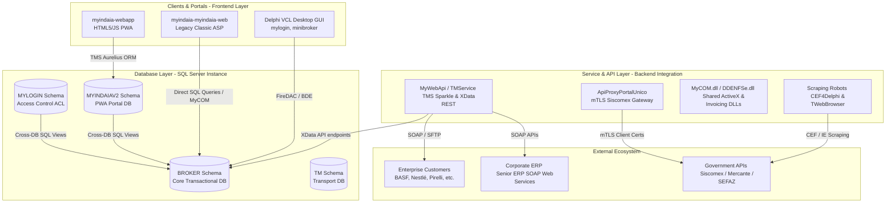

# MyINDAIA Platform: Comprehensive MECE Codebase Scan & Technical Audit Report

This report documents the findings, structural architecture, security vulnerabilities, configuration gaps, and operational risks discovered during the comprehensive technical scan of the **MyINDAIA** platform codebase.

To ensure **MECE (Mutually Exclusive, Collectively Exhaustive)** compliance, **all 48 subfolders** in the [myindaia-codebase](../../myindaia-codebase) directory have been audited, classified, and mapped into exactly one category with zero omissions.

---

## 1. Executive Summary

### 1.1 Business Context & Purpose

The **MyINDAIA** platform is the operational core of **Indaiá Logística**, a Brazilian customs broker and logistics provider. The platform automates, orchestrates, and monitors highly complex international trade workflows, ensuring compliance with Brazilian regulatory agencies. It acts as the middleware between internal customs agents, corporate clients, government portals, and external logistics operators (such as freight forwarders and inland transport carriers).

### 1.2 Core Capabilities

- **Customs Clearance Management**: Orchestrates documentation and clearance flows for import and export processes, tracking parameters like customs channels (Green, Yellow, Red, Gray).
- **Government Portal Integrations**: Automates data submissions and extractions from Brazilian trade portals, specifically:
  - **Siscomex** (Sistema Integrado de Comércio Exterior): Processing **DU-E** (Declaração Única de Exportação), **DUIMP** (Declaração Única de Importação), and **LI** (Licença de Importação) transactions.
  - **Mercante**: Managing maritime freight registry scraping, tax calculations, and payment slip generations.
- **B2B Client Integrations**: Automates data exchanges and tracking milestones for major multinational industrial clients (including **BASF**, **Nestlé**, **Pirelli**, **Cebrace**, **AGC Glass**, and **Croda**) using formats like EDI, XML, and JSON.
- **Financial & Invoicing Operations**: Automates financial reconciliations (integrating directly with **Senior ERP** web services) and processes electronic service invoices (NF-e/NFS-e) using the ACBr framework.

---

## 2. High-Level System Architecture

The MyINDAIA platform represents a hybrid, multi-generational architecture spanning more than two decades of technical evolution. It runs on a Windows Server and SQL Server infrastructure, combining legacy desktop forms, web scripts, compiled service binaries, and modern progressive web applications.

### 2.1 Component Layer Classification

The 48 audited subprojects in the codebase fall into five functional architectural archetypes:

1. **Shared Frameworks & Vendor Cores**: Reusable UI and database components, including custom JSON parsers (`MyPatterns`) and object-relational mapping frameworks (`TMS Aurelius`).
2. **REST APIs & Services**: Modernized Windows services using TMS Sparkle and XData to serve JSON payloads, run background jobs, and manage communication tunnels.
3. **Government Automation & RPA Robots**: Automation scripts that perform UI-driven crawling or API-level integration with regulatory platforms. These rely on either physical certificate tokens (using `CEF4Delphi` custom browsers) or automated web sessions (Internet Explorer ActiveX wrappers).
4. **B2B Client Connectors**: Dynamic libraries (DLLs) and console projects that parse incoming files (XML, CSV, spreadsheets) from clients and submit operational statuses back to corporate systems.
5. **Invoicing & Financial Engines**: Services interacting with Senior ERP systems to settle client balances and issue government-approved invoice sheets.

---

## 3. Database Topology & Server-Side Automation

The database layer runs on a single Microsoft SQL Server instance divided into **9 logical databases (schemas)**, showing tight coupling and extensive server-side business automation.

### 3.1 Logical Schemas

- `**BROKER` (1,204 tables)**: The system's operational core. It stores customs folders, follow-up events, and invoices. It has minimal relational constraint mapping (only 187 foreign keys), delegating integrity checks to client code.
- `**MYINDAIAV2` (69 tables)**: Used exclusively by the modern customer portal PWA. Mapped in English using the TMS Aurelius ORM.
- `**MYLOGIN` (7 tables)**: Stores Access Control Lists (ACL), routine configurations, and system permissions.
- `**TM` (33 tables)**: Manages inland road transportation, routes, and dispatcher files.
- `**MYINDAIA` (216 tables)**: Backs the legacy Classic ASP customer portal.

### 3.2 Cross-Database Views & Triggers

To bridge the modern and legacy components without replicating tables, the schemas are interconnected at the database level:

- **Cross-Database Views**: `MYINDAIAV2` and `MYLOGIN` access the core `BROKER` transactional data via views like `vw_Processo_Resumo` and `VW_USUARIO` that execute cross-database joins in real-time.
- **T-SQL Automation (`TR_FOLLOWUP`)**: A massive database trigger configured on `BROKER.dbo.TFOLLOWUP` automatically chains tracking events, calculates Business Day Estimated Time of Arrival (ETA) via `dbo.FN_ADD_DIAS_UTEIS` for clients like Nestlé and Croda, and controls downstream processing.
- **Bypass Safeguards**: High-speed batch loaders write process IDs to `TFOLLOWUP_IGNORE_TRIGGERS` using the database connection session ID (`@@SPID`) to bypass trigger logic during mass updates.

---

## 4. Key Security & Technical Debt Findings

A primary goal of this audit was mapping architectural risks to prepare a migration plan:

- **Database Privilege Escalation**: Every application user possesses a native SQL Server login. When users are created, the stored procedure `sp_inclui_login` assigns them the server-level `securityadmin` role and makes them the database owner (`db_owner`) across 9 databases. This allows any user to connect directly to the database port and alter tables, delete backups, or compromise the host.
- **Hardcoded Secrets**: Multiple API keys, JWT validation signatures, Senior ERP SOAP service passwords, and database administrator (`sa`) accounts with weak passwords (`"123"`) are committed directly in source files.
- **mTLS Certificate Binding**: Government scraping services load local `.pem` and `.key` certificates bound to individual customs brokers' names, creating an operational dependency on specific people's active credentials.
- **BDE Engine Deprecation**: Core B2B components utilize the obsolete Borland Database Engine (BDE) from the late 1990s, introducing performance bottlenecks and OS compatibility issues.

---

## 5. Modernization & Migration Strategy (Strangler Fig)

The migration roadmap aims to incrementally replace legacy desktop forms and Classic ASP pages with a modern, microservice-based architecture while maintaining continuous operations.

1. **Phase 0 (Infrastructure Prep & Security Hotfixes)**: Abstracting hardcoded credentials into environment configurations, moving credentials to secret vaults, and routing government connections through a centralized mTLS reverse proxy.
2. **Phase 1 (Export Workflows)**: Rebuilding export modules (DU-E API, Playwright-based browser robots, and B2B pipelines) as isolated server-side services (utilizing **Python / FastAPI** and the **Agno AI Agent framework**). Modern data sync adapters ensure real-time replication with the legacy SQL database.
3. **Phase 2 (Import Workflows & Legacy Retirement)**: Porting the complex database triggers and batch LI checking modules to application code, migrating the remaining Classic ASP logic, and deprecating legacy database users in favor of a centralized Identity Provider (JWT-based Auth0 or Keycloak).

---

## 6. Report Structure

The results of this codebase scan and database audit are split into the following detailed documents:

- **[1. System Topology & MECE Component Mapping](01_system_topology.md)**: Classifies the 48 folders into 8 distinct architectural groups.
- **[2. Key Technical Findings & Security Gaps](02_key_findings.md)**: Details vulnerability traces, hardcoded scripts, and driver/IP dependencies.
- **[3. Recommended Actions & Next Steps](03_recommended_actions.md)**: Outlines actionable items to secure and clean the legacy repository.
- **[4. Deep-Dive Module Scan — Remaining 23 Folders](04_deep_dive_remaining_23.md)**: Code audits for shared libraries, minor client scripts, and automation tools.
- **[5. Database Topology & Server-Side Logic Audit](05_database_topology.md)**: Relational schema matrices, cross-database views, and T-SQL trigger logic.
- **[6. Deep-Dive Module Scan — First 25 Folders (HIGH Priority)](06_deep_dive_first_25.md)**: Code audits of primary REST APIs, SSO libraries, and the wallet reconciliation modules.
